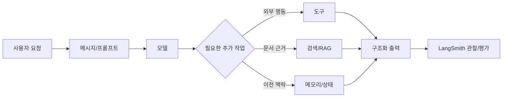

# LangChain-LangSmith 보충 학습 노트

작성 기준일: 2026-06-17  
읽는 대상: Python 기초는 조금 있지만 클래스, 객체지향, DB, LangChain 용어가 아직 낯선 분  
읽는 목적: 수업에서 특정 개념이 헷갈릴 때 원하는 구간만 골라 읽기

이 자료는 하나의 긴 글이 아니라, 노션에 페이지별로 올리기 좋은 **주제별 보충 게시글 묶음**입니다. 처음부터 순서대로 읽어도 되고, 헷갈리는 부분만 골라 읽어도 됩니다.

도구, 모델명, 패키지 import 경로는 바뀔 수 있습니다. 하지만 아래 개념들은 오래 갑니다.

- 사용자의 말을 모델이 이해하기 좋은 메시지로 정리한다.
- 모델에게 역할, 맥락, 출력 기준을 준다.
- 모델이 직접 못 하는 일은 도구로 연결한다.
- 모델이 모르는 문서는 검색해서 근거로 건넨다.
- 이전 대화와 작업 상태는 필요한 만큼 관리한다.
- 결과는 앱이 읽을 수 있는 구조로 받는다.
- 실행 과정은 trace로 보고, 품질은 evaluation으로 확인한다.

## 핵심 읽기 순서

1. [전체 그림: AI에게 물어보기와 AI 앱 만들기는 다르다](랭체인_랭스미스_보충학습노트/01_전체_그림.md)
2. [객체, 클래스, 스키마: LangChain 문서가 갑자기 어려워지는 이유](랭체인_랭스미스_보충학습노트/02_객체_클래스_스키마.md)
3. [메시지와 프롬프트: 모델에게 일을 시키는 말의 구조](랭체인_랭스미스_보충학습노트/03_메시지와_프롬프트.md)
4. [흐름, Chain, Runnable, Agent: LLM 앱은 단계로 움직인다](랭체인_랭스미스_보충학습노트/04_흐름_체인_에이전트.md)
5. [Tool Calling: 모델이 함수와 API를 쓰게 하는 방식](랭체인_랭스미스_보충학습노트/05_Tool_Calling.md)
6. [DB, DBMS, Vector DB, RAG: LangChain에서 DB는 어떻게 쓰일까](랭체인_랭스미스_보충학습노트/06_DB와_RAG.md)
7. [Memory, Thread, State: 대화를 이어가는 법](랭체인_랭스미스_보충학습노트/07_Memory_Thread_State.md)
8. [Structured Output: 앱이 읽을 수 있는 답을 받는 법](랭체인_랭스미스_보충학습노트/08_Structured_Output.md)
9. [LangSmith Trace: 답이 틀린 원인을 찾는 법](랭체인_랭스미스_보충학습노트/09_LangSmith_Trace.md)
10. [LangSmith Evaluation: 좋아졌는지 기준으로 확인하는 법](랭체인_랭스미스_보충학습노트/10_LangSmith_Evaluation.md)
11. [업무 자동화 에이전트: 배운 개념이 합쳐지는 모습](랭체인_랭스미스_보충학습노트/11_업무_자동화_에이전트.md)

## 부록

- [헷갈릴 때 다시 보는 용어와 질문 모음](랭체인_랭스미스_보충학습노트/부록_A_용어와_질문_모음.md)
- [자료 설계 메모: 이 자료를 만들며 깨달은 점](랭체인_랭스미스_보충학습노트/부록_B_자료_설계_메모.md)

## 전체 지도

## 공식 문서 링크

최신 API와 코드 예시는 아래 공식 문서를 먼저 확인하세요.

- [LangChain overview](https://docs.langchain.com/oss/python/langchain/overview)
- [LangChain agents](https://docs.langchain.com/oss/python/langchain/agents)
- [LangChain messages](https://docs.langchain.com/oss/python/langchain/messages)
- [LangChain tools](https://docs.langchain.com/oss/python/langchain/tools)
- [LangChain structured output](https://docs.langchain.com/oss/python/langchain/structured-output)
- [LangChain RAG tutorial](https://docs.langchain.com/oss/python/langchain/rag)
- [LangChain short-term memory](https://docs.langchain.com/oss/python/langchain/short-term-memory)
- [LangSmith observability](https://docs.langchain.com/langsmith/observability)
- [LangSmith observability concepts](https://docs.langchain.com/langsmith/observability-concepts)
- [LangSmith evaluation](https://docs.langchain.com/langsmith/evaluation)
- [LangSmith evaluation concepts](https://docs.langchain.com/langsmith/evaluation-concepts)
