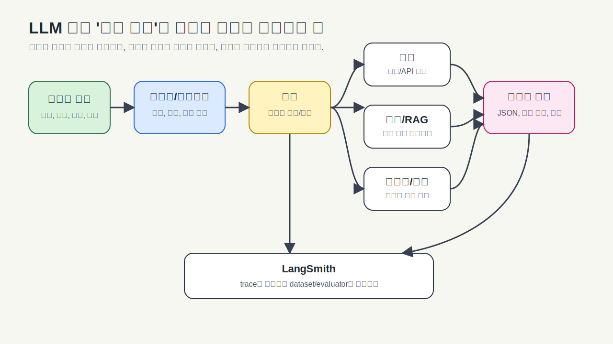
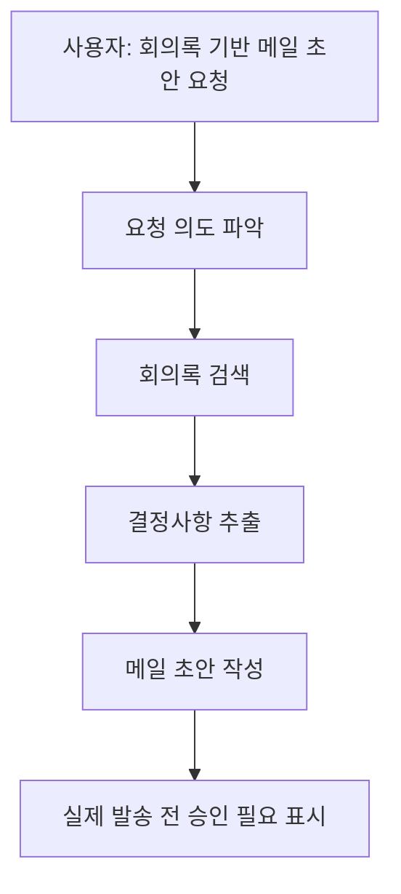

# 전체 그림: AI에게 물어보기와 AI 앱 만들기는 다르다

수업을 듣다 보면 처음에는 LangChain이 그냥 "ChatGPT를 코드로 부르는 방법"처럼 보일 수 있습니다. 하지만 조금만 들어가면 갑자기 message, prompt, tool, RAG, memory, trace 같은 말이 쏟아집니다. 여기서 길을 잃지 않으려면 먼저 질문 하나를 잡아야 합니다.

**AI에게 물어보는 것과 AI 앱을 만드는 것은 무엇이 다를까요?**

ChatGPT 화면에서 질문을 입력하고 답을 받는 일은 사람이 많은 것을 대신 정리합니다. 내가 상황을 설명하고, 답이 이상하면 다시 물어보고, 필요한 자료를 직접 붙여넣고, 결과가 맞는지 판단합니다. 반면 AI 앱을 만들 때는 그 일을 코드가 맡아야 합니다. 사용자의 요청을 모델이 이해하기 좋은 모양으로 바꾸고, 필요한 자료를 찾아주고, 위험한 행동은 막고, 답변이 앱에서 쓸 수 있는 구조인지 확인해야 합니다.

예를 들어 사용자가 이렇게 말했다고 해봅시다.

> 지난 회의록에서 결정사항만 뽑아서 고객에게 보낼 메일 초안으로 정리해줘.

사람은 이 문장을 듣자마자 머릿속에서 여러 단계를 나눕니다. 먼저 지난 회의록을 찾아야 합니다. 그 안에서 결정사항만 골라야 합니다. 그 내용을 고객에게 보내도 되는 말투로 바꿔야 합니다. 그리고 실제 메일 발송은 바로 하면 안 되고, 초안으로 보여준 뒤 확인을 받아야 합니다.

좋은 LLM 앱도 똑같이 생각합니다. 모델에게 "알아서 해줘"라고 던지는 것이 아니라, 필요한 단계를 설계합니다.

여기서 LangChain이 맡는 일은 "모델 주변의 흐름을 조립하는 것"에 가깝습니다. 모델만 있으면 문장은 만들 수 있지만, 앱으로 쓰려면 주변 장치가 필요합니다.

메시지와 프롬프트는 모델에게 일을 시키는 말의 구조입니다. 도구는 모델이 직접 못 하는 일을 함수나 API로 연결하는 통로입니다. RAG는 모델이 모르는 문서를 검색해 근거로 건네는 방식입니다. 메모리와 상태는 이전 대화와 작업 흐름을 이어가기 위한 장치입니다. 구조화 출력은 사람이 읽기 좋은 답뿐 아니라 앱이 읽을 수 있는 답을 받는 방법입니다. LangSmith는 이 과정이 실제로 어떻게 흘러갔는지 보고 평가하는 도구입니다.

> #### 이게 뭔데? API
> API는 다른 프로그램에 일을 요청하는 공식 창구입니다. 식당으로 치면 주방 안으로 직접 들어가는 것이 아니라 주문서를 통해 요청하는 것과 비슷합니다. AI 앱에서 API는 모델을 부르거나, 검색 서비스를 쓰거나, 회사 시스템에 데이터를 요청할 때 자주 등장합니다.

> #### 이게 뭔데? 모델 제공사
> OpenAI, Anthropic, Google처럼 모델을 제공하는 회사나 서비스를 provider라고 부르기도 합니다. LangChain 코드에서 `"openai:gpt-..."`처럼 provider와 모델명을 함께 쓰는 경우가 있습니다. 이 표기는 바뀔 수 있으니 외우기보다 "어느 회사의 어느 모델을 쓰는지 표시하는구나" 정도로 보면 됩니다.

이 자료 전체에서 계속 반복되는 생각은 하나입니다. 도구와 API는 바뀔 수 있지만, **요청을 정리하고, 필요한 맥락을 넣고, 안전하게 행동을 연결하고, 결과를 관찰하고 평가한다**는 뼈대는 오래 갑니다.

[다음 글: 객체, 클래스, 스키마](02_객체_클래스_스키마.md)
