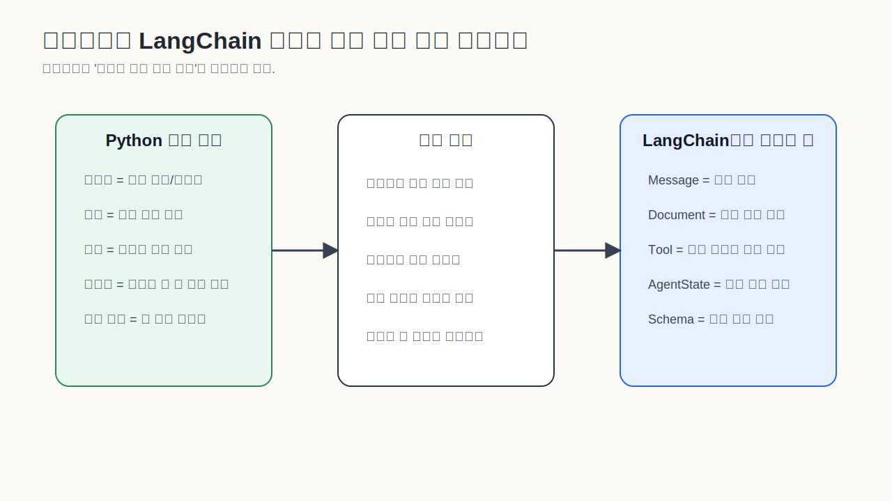
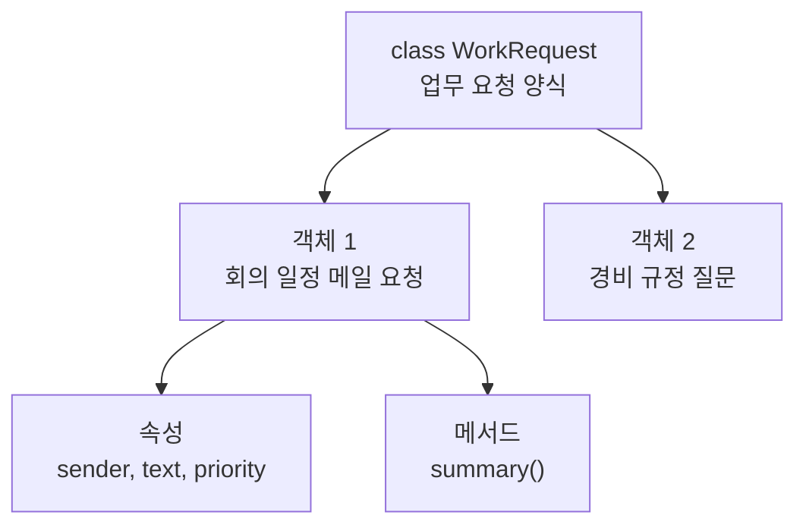

# 객체와 클래스: LangChain 문서가 갑자기 어려워지는 이유

LangChain 문서를 읽다 보면 `Message`, `Document`, `Tool`, `AgentState`, `BaseModel`, `schema` 같은 말이 계속 나옵니다. Python 클래스와 객체에 익숙하지 않으면 이 순간부터 문서가 갑자기 개발자 전용 문서처럼 느껴질 수 있습니다.

하지만 처음부터 객체지향을 깊게 공부할 필요는 없습니다. LangChain을 읽기 위해서는 우선 이렇게만 잡으면 됩니다.

**객체는 역할이 붙은 자료 묶음입니다.**

그냥 문자열 하나만 있으면 그것이 사용자 요청인지, 모델 답변인지, 검색된 문서인지 알기 어렵습니다. 그래서 LangChain에서는 단순 문자열 대신 "역할이 있는 자료"를 자주 씁니다. 어떤 것은 메시지이고, 어떤 것은 문서 조각이고, 어떤 것은 모델이 호출할 수 있는 도구입니다.



회사 업무 카드로 생각해보면 쉽습니다. "메일 보내기"라는 업무가 생기면 카드에는 받는 사람, 목적, 말투, 마감일 같은 정보가 적힙니다. 그 카드는 단순한 글자 뭉치가 아니라 "메일 업무 요청"이라는 역할을 가집니다. Python의 객체도 비슷합니다. 데이터만 있는 것이 아니라, 그 데이터가 어떤 역할을 하는지까지 묶어서 다룹니다.

아주 작은 예시를 보겠습니다.

```python
class WorkRequest:
    def __init__(self, sender: str, text: str, priority: str):
        self.sender = sender
        self.text = text
        self.priority = priority

    def summary(self) -> str:
        return f"[{self.priority}] {self.sender}: {self.text}"
```

이 코드를 문법부터 외우려 하면 어렵습니다. 대신 이렇게 읽어보면 됩니다. `WorkRequest`는 업무 요청 양식입니다. `sender`, `text`, `priority`는 그 카드에 적히는 정보입니다. `summary()`는 그 카드를 한 줄로 요약하는 행동입니다. `self`는 "지금 만들어진 바로 이 카드"입니다.



LangChain의 `Message`도 같은 방식으로 보면 됩니다. message는 그냥 글자가 아니라 "누가 한 말인지" 역할을 가진 자료입니다. `Document`는 문서 내용만 들고 있는 것이 아니라 출처, 페이지, 파일명 같은 metadata를 함께 들고 있을 수 있습니다. `Tool`은 모델이 호출할 수 있는 함수 역할을 합니다.

스키마는 여기서 한 단계 더 나아갑니다. 스키마는 데이터 양식표입니다. 어떤 정보가 들어와야 하는지, 어떤 이름의 필드가 있어야 하는지, 그 값이 문자열인지 숫자인지 참/거짓인지 정해둡니다. 이 글에서는 일단 "데이터의 모양을 정한 약속" 정도로만 잡고 넘어가도 됩니다.

예를 들어 업무 자동화 에이전트의 답이 아래처럼 나오길 원한다고 해봅시다.

```json
{
  "request_type": "email_draft",
  "answer": "메일 초안 내용",
  "requires_approval": true
}
```

이때 스키마는 "request_type은 문자열이어야 하고, answer도 문자열이어야 하고, requires_approval은 참/거짓이어야 한다"는 약속입니다. 모델 답변을 앱에서 안정적으로 쓰려면 이런 약속이 중요합니다. 스키마는 다음 글에서 신청서, API, DB 예시로 더 넓게 다시 잡습니다.

> #### 이게 뭔데? 클래스와 객체
> 클래스는 양식 또는 설계도입니다. 객체는 그 양식으로 실제 만들어진 자료입니다. "학생 기록부 양식"이 클래스라면, "김민지 학생의 실제 기록부"가 객체입니다.

> #### 이게 뭔데? 속성과 메서드
> 속성은 객체가 들고 있는 정보입니다. 메서드는 객체가 할 수 있는 행동입니다. 학생 기록부 객체에 `name`, `score`가 속성이라면, `average()` 같은 것은 행동에 가깝습니다.

> #### 이게 뭔데? 스키마
> 스키마는 데이터의 모양을 정한 약속입니다. 설문지 양식을 떠올리면 됩니다. 이름 칸, 전화번호 칸, 동의 여부 체크 칸이 정해져 있으면 나중에 데이터를 정리하기 쉽습니다. AI 앱에서도 모델 답변을 정해진 구조로 받으려면 스키마가 필요합니다.

여기서 중요한 것은 객체지향 문법을 완벽히 외우는 것이 아닙니다. LangChain 문서에서 어떤 자료가 나오면 "이건 어떤 역할을 가진 카드인가?"라고 읽는 습관입니다.

[이전 글](01_전체_그림.md) · [다음 글: 스키마](02_스키마_정보를_담는_틀.md)
