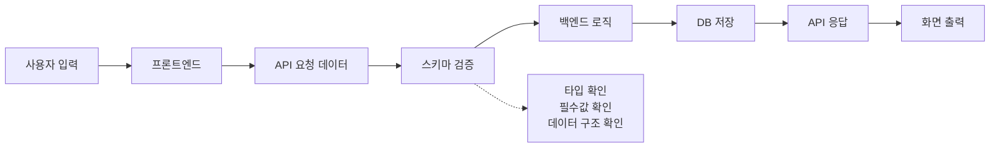
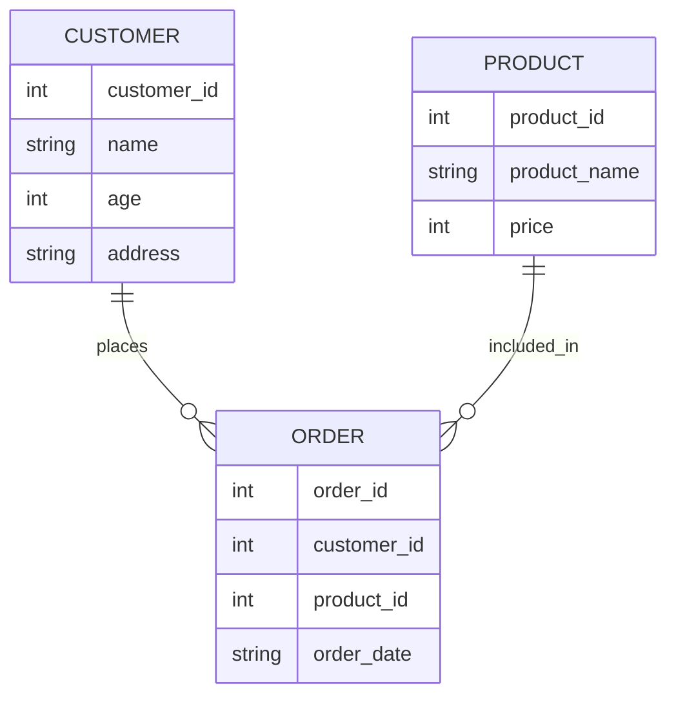
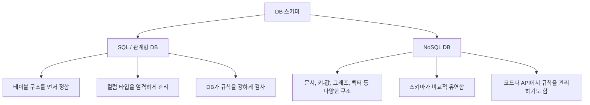
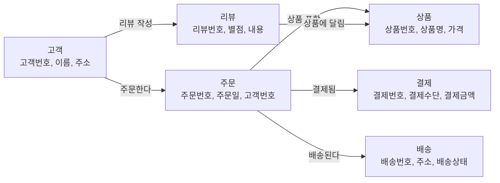
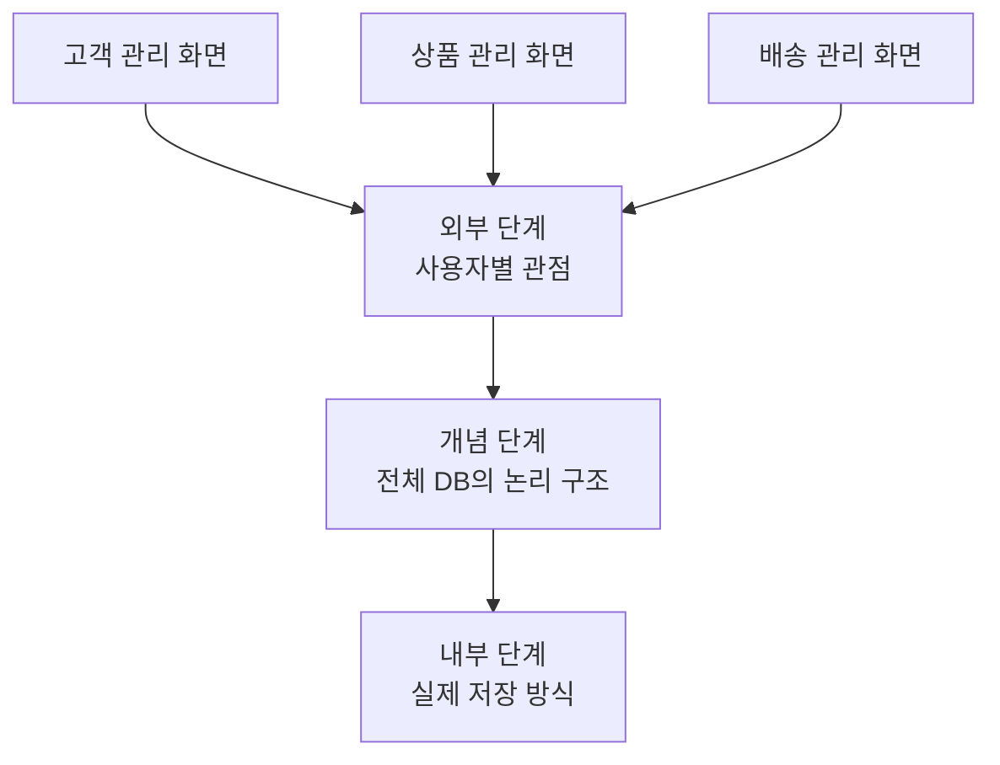
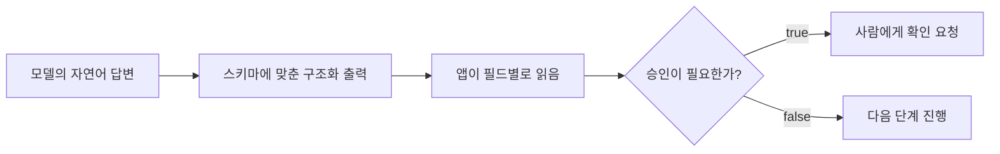

# 스키마: 정보를 담기 위한 구조와 약속

스키마는 처음부터 DB 용어로 외우기보다, 먼저 **정보를 담기 위한 구조나 틀**이라고 이해하면 훨씬 쉽습니다. 그다음 프로그래밍, 데이터베이스, LangChain 쪽으로 조금씩 좁혀가면 됩니다.

## 넓은 의미의 스키마

스키마는 꼭 데이터베이스에서만 쓰는 말이 아닙니다. 넓게 보면 **어떤 정보를 어떤 구조로 담을지 정해 놓은 틀**입니다.

신청서를 떠올려보겠습니다.

```text
이름:
전화번호:
이메일:
주소:
수강 희망 과정:
```

아직 실제 값은 들어가지 않았지만, 이미 어떤 정보를 받을지 정해져 있습니다. 이 신청서의 스키마는 `이름`, `전화번호`, `이메일`, `주소`, `수강 희망 과정`이라는 항목 목록입니다. 즉, 스키마는 데이터가 들어가기 전의 틀이라고 볼 수 있습니다.

엑셀 표도 비슷합니다.

| 이름 | 나이 | 전화번호 | 주소 |
| --- | --- | --- | --- |
| 김철수 | 25 | 010-1234-5678 | 서울 |
| 이영희 | 31 | 010-2222-3333 | 부산 |

여기서 실제 데이터는 `김철수`, `25`, `서울` 같은 값입니다. 반면 스키마는 `이름`, `나이`, `전화번호`, `주소`라는 열 구조입니다.

설문지도 마찬가지입니다.

```text
1. 이름을 입력하세요.
2. 나이를 입력하세요.
3. 만족도를 1~5점으로 선택하세요.
4. 의견을 자유롭게 작성하세요.
```

이 설문지는 어떤 정보를 어떤 방식으로 받을지 미리 정해두었습니다. 그래서 넓은 의미에서는 설문지 역시 스키마처럼 볼 수 있습니다.

> #### 이게 뭔데? 스키마
> 스키마는 정보를 아무렇게나 받지 않기 위해 정해둔 구조입니다. 신청서에 이름 칸, 전화번호 칸, 이메일 칸이 미리 있는 것처럼, 데이터에도 어떤 항목이 있어야 하는지 정해둘 수 있습니다.

여기까지는 이렇게 기억하면 됩니다. 스키마는 **정보를 어떤 항목과 규칙으로 담을지 정한 구조**입니다.

## 프로그래밍에서의 스키마

프로그래밍에서는 데이터가 여러 곳을 오갑니다.

```text
사용자 입력
프론트엔드
백엔드
API
DB
```

이때 구조가 정해져 있지 않으면 문제가 생깁니다. 이름이 문자열로 와야 하는데 숫자가 들어올 수 있고, 나이가 숫자로 와야 하는데 글자가 들어올 수 있습니다. 꼭 필요한 값이 빠질 수도 있고, 예상하지 못한 데이터가 들어올 수도 있습니다.

그래서 프로그래밍에서 스키마는 보통 이렇게 쓰입니다.

> 데이터가 어떤 필드를 가지고, 각 필드의 타입은 무엇이며, 어떤 값이 필수인지 정한 규칙

예를 들어 사용자 데이터가 이렇게 온다고 해봅시다.

```json
{
  "name": "김철수",
  "age": 25,
  "email": "kim@example.com"
}
```

이 데이터의 스키마는 이렇게 설명할 수 있습니다.

```text
name: 문자열
age: 숫자
email: 문자열
```

프론트엔드와 백엔드가 게시글 데이터를 주고받는 상황도 보겠습니다.

```json
{
  "id": 1,
  "title": "질문 제목",
  "content": "질문 내용",
  "author": "홍길동"
}
```

이 API 데이터의 스키마는 다음과 같습니다.

```text
id: 숫자
title: 문자열
content: 문자열
author: 문자열
```

API 스키마는 프론트엔드와 백엔드가 데이터를 주고받기 위한 약속입니다. 한쪽은 `title`이라고 보내는데 다른 쪽은 `subject`를 기대한다면, 화면이나 기능이 깨질 수 있습니다.

> #### 이게 뭔데? 필드와 타입
> 필드는 데이터 안의 한 항목입니다. `name`, `age`, `email` 같은 이름이 필드입니다. 타입은 값의 종류입니다. 문자열, 숫자, 참/거짓, 날짜처럼 값이 어떤 종류인지 말합니다.

Python에서는 Pydantic을 사용해 데이터 구조를 정의할 수 있습니다.

```python
from pydantic import BaseModel

class Customer(BaseModel):
    name: str
    age: int
    address: str
```

이 코드는 다음 약속을 의미합니다.

```text
Customer 데이터는 name, age, address를 가진다.
name은 문자열이다.
age는 정수이다.
address는 문자열이다.
```

즉, Pydantic 모델은 파이썬 코드 안에서 데이터 스키마를 정의하는 방법입니다. LangChain에서 structured output을 다룰 때도 이런 식의 스키마 사고가 자주 등장합니다.



프로그래밍에서 스키마는 **데이터를 주고받을 때 지켜야 하는 구조와 타입에 대한 약속**입니다.

## 데이터베이스에서의 스키마

DB에서 스키마는 **데이터베이스에 어떤 데이터를 어떤 구조와 제약 조건으로 저장할지 정한 설계도**입니다.

예를 들면 이런 것들을 정합니다.

```text
어떤 테이블이 있는가?
각 테이블에는 어떤 컬럼이 있는가?
각 컬럼의 타입은 무엇인가?
어떤 값은 비어 있으면 안 되는가?
어떤 값은 중복되면 안 되는가?
테이블과 테이블은 어떻게 연결되는가?
```

고객 데이터를 담은 테이블로 보면 더 쉽습니다.

| 고객번호 | 이름 | 나이 | 주소 |
| --- | --- | --- | --- |
| 1 | 김철수 | 25 | 서울 |
| 2 | 이영희 | 31 | 부산 |

이 테이블의 스키마는 다음처럼 볼 수 있습니다.

```text
고객번호: 숫자
이름: 문자열
나이: 숫자
주소: 문자열
```

즉, DB 스키마는 데이터를 저장하기 위한 칸과 규칙을 정해 놓은 것입니다.

> #### 이게 뭔데? 제약 조건
> 제약 조건은 데이터가 지켜야 하는 제한 규칙입니다. 예를 들어 고객번호는 비어 있으면 안 된다, 이메일은 중복되면 안 된다, 나이는 숫자여야 한다 같은 규칙이 제약 조건입니다.

## Entity, Attribute, Relationship

DB 스키마를 이해할 때 자주 나오는 말이 있습니다.

| 용어 | 쉬운 뜻 | 예시 |
| --- | --- | --- |
| Entity | 저장하고 싶은 대상 | 고객, 상품, 주문 |
| Attribute | 대상이 가진 속성 또는 컬럼 | 이름, 나이, 주소 |
| Relationship | 대상들 사이의 관계 | 고객이 상품을 주문한다 |

쇼핑몰에서는 보통 고객, 상품, 주문 데이터를 저장합니다. 고객은 주문을 하고, 주문에는 상품이 포함됩니다.



> #### 이게 뭔데? Entity
> Entity는 DB에 저장하고 싶은 대상입니다. 쇼핑몰에서는 고객, 상품, 주문이 각각 entity가 될 수 있습니다.

> #### 이게 뭔데? Attribute
> Attribute는 entity가 가진 속성입니다. 고객이라는 entity에는 이름, 나이, 주소 같은 attribute가 붙을 수 있습니다. 표로 보면 컬럼에 가깝습니다.

> #### 이게 뭔데? Relationship
> Relationship은 entity 사이의 관계입니다. 고객과 주문은 "고객이 주문한다"로 연결되고, 주문과 상품은 "주문에 상품이 포함된다"로 연결됩니다.

## SQL DB와 NoSQL DB의 스키마

SQL 기반 관계형 DB에서는 보통 스키마를 엄격하게 정합니다. 고객 테이블을 만들 때는 먼저 구조를 정합니다.

```sql
CREATE TABLE customers (
    customer_id INT,
    name VARCHAR(50),
    age INT,
    address TEXT
);
```

이 뜻은 다음과 같습니다.

```text
customer_id는 숫자
name은 문자열
age는 숫자
address는 긴 문자열
```

SQL DB는 보통 스키마를 먼저 정하고 데이터를 넣는 방식입니다.

NoSQL DB에도 스키마가 있을 수 있습니다. 다만 SQL DB처럼 항상 딱딱하게 강제되는 것은 아닙니다. MongoDB 같은 문서형 DB에서는 이런 데이터를 저장할 수 있습니다.

```json
{
  "name": "김철수",
  "age": 25,
  "address": "서울"
}
```

같은 컬렉션 안에 이런 데이터도 들어갈 수 있습니다.

```json
{
  "name": "이영희",
  "phone": "010-1111-2222"
}
```

그래서 NoSQL DB를 흔히 schema-less라고 부릅니다. 하지만 정확히는 스키마가 아예 없는 것이 아니라, **스키마를 더 유연하게 다루는 경우가 많다**고 보는 편이 좋습니다. 실무에서는 NoSQL을 사용하더라도 코드, API, 문서, 검증 로직을 통해 데이터 구조를 정해두는 경우가 많습니다.



## DB를 보는 세 단계

DB는 관점에 따라 세 단계로 나누어 볼 수 있습니다.

```text
외부 단계: 사용자 관점
개념 단계: 조직 전체 관점
내부 단계: 물리적 저장 관점
```

외부 단계는 사용자별 화면이나 필요한 데이터의 모습입니다. 같은 쇼핑몰 DB를 쓰더라도 고객 관리 담당자는 고객 정보를 보고, 상품 관리 담당자는 상품 정보를 보고, 배송 담당자는 배송 정보를 봅니다.

개념 단계는 조직 전체 관점입니다. 쇼핑몰 전체 DB를 본다면 고객, 상품, 주문, 결제, 배송, 리뷰가 필요하고, 이 데이터들이 서로 어떻게 연결되는지도 정해야 합니다.



보통 우리가 일반적으로 "DB 스키마"라고 말할 때는 이 개념 단계의 스키마에 가까운 의미로 쓰는 경우가 많습니다.

내부 단계는 물리적 저장 관점입니다. 데이터를 디스크 어디에 저장할지, 검색을 빠르게 하기 위해 인덱스를 만들지, 파일을 어떤 방식으로 나눌지 같은 내용입니다. 일반 사용자가 직접 보는 영역이라기보다는 DBMS가 데이터를 효율적으로 저장하고 찾기 위해 관리하는 영역입니다.



## 데이터 독립성

데이터 독립성은 **한쪽 구조가 바뀌어도 다른 쪽에 영향을 최대한 덜 주는 성질**입니다. DB 구조가 조금 바뀔 때마다 사용자 화면이나 프로그램 전체를 다 고쳐야 한다면 너무 불편합니다.

논리적 독립성은 개념 스키마가 바뀌어도 외부 스키마에 영향을 덜 주는 것입니다. 예를 들어 고객 테이블에 `등급` 컬럼이 추가되어도, 고객센터 화면에서 등급을 보여줄 필요가 없다면 기존 화면은 그대로 사용할 수 있습니다.

물리적 독립성은 내부 스키마가 바뀌어도 개념 스키마와 외부 스키마에 영향을 덜 주는 것입니다. 예를 들어 검색 속도를 빠르게 하기 위해 DB에 인덱스를 추가해도, 사용자는 여전히 같은 화면에서 같은 방식으로 검색합니다.

> #### 이게 뭔데? 데이터 독립성
> 데이터 독립성은 안쪽 구조가 조금 바뀌어도 바깥쪽 사용 방식이 최대한 그대로 유지되는 성질입니다. 사용자는 같은 화면을 보지만, 안쪽 저장 방식은 더 빠르고 효율적으로 바뀔 수 있습니다.

## LangChain에서 스키마가 중요한 이유

LangChain을 배울 때 스키마는 DB에서만 쓰이는 말이 아닙니다. 다음 상황에서 계속 등장합니다.

| 상황 | 스키마가 하는 일 |
| --- | --- |
| Tool calling | 도구에 어떤 인자를 넘겨야 하는지 정함 |
| Structured output | 모델 답변을 어떤 JSON 구조로 받을지 정함 |
| RAG | 문서 내용과 metadata가 어떤 구조인지 정함 |
| Memory / State | 대화 상태나 작업 상태가 어떤 필드를 가질지 정함 |
| LangSmith evaluation | 평가 데이터와 결과가 어떤 구조를 가질지 정함 |

예를 들어 업무 자동화 에이전트가 이런 답을 반환해야 한다고 해봅시다.

```json
{
  "request_type": "email_draft",
  "answer": "메일 초안 내용",
  "requires_approval": true,
  "warning": "실제 발송 전 확인이 필요합니다."
}
```

이때 스키마는 `request_type`과 `answer`는 문자열이고, `requires_approval`은 참/거짓이며, `warning`은 경고 문구라는 약속입니다. 이 약속이 있어야 앱이 모델의 답을 안정적으로 읽고 다음 행동을 결정할 수 있습니다.



## 오래 기억할 것

- 스키마는 정보를 담기 위한 구조와 약속이다.
- 신청서, 엑셀 열, 설문지, JSON, DB 테이블은 모두 스키마를 이해하는 좋은 예시다.
- 프로그래밍에서 스키마는 필드, 타입, 필수값을 정해 데이터가 안전하게 오가도록 돕는다.
- DB에서 스키마는 테이블, 컬럼, 타입, 제약 조건, 관계를 정한 설계도에 가깝다.
- NoSQL은 스키마가 아예 없는 것이 아니라, 스키마를 더 유연하게 다루는 경우가 많다.
- LangChain에서는 tool calling, structured output, RAG, memory, evaluation에서 스키마 사고가 계속 필요하다.

## 지금은 바뀔 수 있는 것

- Pydantic 버전과 문법
- LangChain에서 structured output을 설정하는 구체적인 함수 이름
- 특정 DB나 Vector DB의 설정 방식
- API 문서에서 스키마를 표현하는 포맷

이런 구현 방식은 바뀔 수 있습니다. 하지만 "데이터를 어떤 구조로 받을지 먼저 약속한다"는 생각은 오래 갑니다.

## 여기까지 읽고 확인하기

1. 신청서와 엑셀 표를 왜 스키마처럼 볼 수 있을까요?
2. 프로그래밍에서 필드와 타입을 정하지 않으면 어떤 문제가 생길까요?
3. SQL DB와 NoSQL DB의 스키마는 어떤 점이 다를까요?
4. DB의 외부 단계, 개념 단계, 내부 단계는 각각 누구의 관점에 가까울까요?
5. LangChain의 structured output에서 스키마가 필요한 이유를 한 문장으로 설명해보세요.

[이전 글](02_객체_클래스_스키마.md) · [다음 글: 메시지와 프롬프트](03_메시지와_프롬프트.md)
