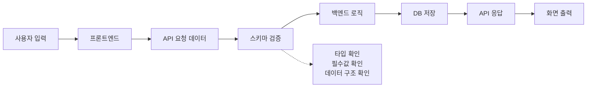
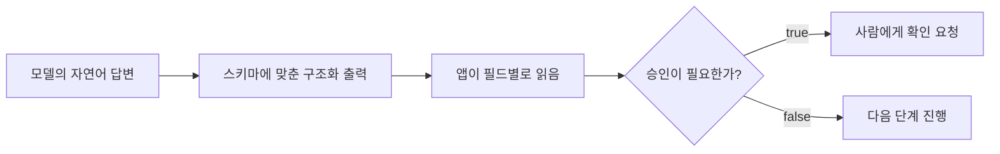

# 스키마: 정보를 담기 위한 구조와 약속

스키마는 처음부터 DB 용어로 외우기보다, 먼저 **정보를 담기 위한 구조나 틀**이라고 이해하면 훨씬 쉽습니다. 그다음 프로그래밍, 데이터베이스, LangChain 쪽으로 조금씩 좁혀가면 됩니다.

먼저 결론부터 잡고 가겠습니다.

> 스키마는 "이 데이터에는 어떤 칸이 있고, 각 칸에는 어떤 종류의 값이 들어와야 하는가"를 정해둔 약속입니다.

그래서 스키마를 알면 데이터를 볼 때 이런 질문을 하게 됩니다.

```text
어떤 항목이 있어야 하지?
각 항목에는 어떤 종류의 값이 들어가지?
비어 있으면 안 되는 값은 무엇이지?
나중에 이 데이터를 누가 어떻게 읽지?
```

이 질문이 중요한 이유는 단순합니다. 사람은 조금 엉성한 표나 문장을 봐도 눈치로 이해할 수 있지만, 프로그램은 구조가 맞아야 안정적으로 읽을 수 있습니다. LangChain에서도 마찬가지입니다. 모델이 자연어로 길게 대답하는 것과, 앱이 바로 읽을 수 있는 구조로 대답하는 것은 완전히 다릅니다.

## 넓은 의미의 스키마

스키마는 꼭 데이터베이스에서만 쓰는 말이 아닙니다. 넓게 보면 **어떤 정보를 어떤 구조로 담을지 정해 놓은 틀**입니다.

> #### 심리학이나 언어학에서는?
> 심리학에서는 스키마를 **머릿속 예상표**처럼 생각하면 됩니다. 예를 들어 식당에 가면 자리에 앉고, 메뉴를 보고, 주문하고, 먹고, 계산한다는 흐름을 이미 알고 있습니다. 누가 하나하나 설명하지 않아도 그런 순서를 떠올리는 틀이 스키마입니다.
>
> 언어학에서도 비슷합니다. 우리는 문장을 볼 때 단어를 하나씩 따로 보지 않고, "누가 무엇을 했다"처럼 익숙한 구조로 묶어서 이해합니다. 여기서 가져갈 핵심은 하나입니다. 스키마는 분야가 달라도 대체로 **정보를 이해하기 쉽게 잡아주는 틀**이라는 뜻으로 쓰입니다.

신청서를 떠올려보겠습니다.

```text
이름:
전화번호:
이메일:
주소:
수강 희망 과정:
```

아직 실제 값은 들어가지 않았지만, 이미 어떤 정보를 받을지 정해져 있습니다. 이 신청서의 스키마는 `이름`, `전화번호`, `이메일`, `주소`, `수강 희망 과정`이라는 항목 목록입니다. 즉, 스키마는 데이터가 들어가기 전의 틀이라고 볼 수 있습니다.

엑셀 표도 비슷합니다.

| 이름 | 나이 | 전화번호 | 주소 |
| --- | --- | --- | --- |
| 김철수 | 25 | 010-1234-5678 | 서울 |
| 이영희 | 31 | 010-2222-3333 | 부산 |

여기서 실제 데이터는 `김철수`, `25`, `서울` 같은 값입니다. 반면 스키마는 `이름`, `나이`, `전화번호`, `주소`라는 열 구조입니다.

설문지도 마찬가지입니다.

```text
1. 이름을 입력하세요.
2. 나이를 입력하세요.
3. 만족도를 1~5점으로 선택하세요.
4. 의견을 자유롭게 작성하세요.
```

이 설문지는 어떤 정보를 어떤 방식으로 받을지 미리 정해두었습니다. 그래서 넓은 의미에서는 설문지 역시 스키마처럼 볼 수 있습니다.

> #### 스키마란?
> 스키마는 정보를 아무렇게나 받지 않기 위해 정해둔 구조입니다. 신청서에 이름 칸, 전화번호 칸, 이메일 칸이 미리 있는 것처럼, 데이터에도 어떤 항목이 있어야 하는지 정해둘 수 있습니다.

여기까지는 이렇게 기억하면 됩니다. 스키마는 **정보를 어떤 항목과 규칙으로 담을지 정한 구조**입니다.

## 프로그래밍에서의 스키마

프로그래밍에서는 데이터가 여러 곳을 오갑니다.

```text
사용자 입력
프론트엔드
백엔드
API
DB
```

여기서 DB는 database의 줄임말입니다. 아주 짧게 말하면 **데이터를 저장하고, 필요할 때 다시 꺼내 쓰기 위한 공간**입니다. 엑셀 파일도 간단한 저장소처럼 볼 수 있지만, DB는 여러 화면, 여러 사용자, 여러 프로그램이 데이터를 함께 쓰기 좋게 더 체계적으로 관리하는 저장소라고 생각하면 됩니다.

DBMS는 그 DB를 관리하는 프로그램입니다. 예를 들어 MySQL, PostgreSQL, SQLite 같은 이름을 들어봤다면 이것들은 DBMS에 가깝습니다. DB와 DBMS는 뒤에서 더 자세히 다루므로, 여기서는 "DB는 데이터를 담는 곳, DBMS는 그 DB를 관리하는 도구" 정도만 기억해도 충분합니다.

이때 구조가 정해져 있지 않으면 문제가 생깁니다. 이름이 문자열로 와야 하는데 숫자가 들어올 수 있고, 나이가 숫자로 와야 하는데 글자가 들어올 수 있습니다. 꼭 필요한 값이 빠질 수도 있고, 예상하지 못한 데이터가 들어올 수도 있습니다.

그래서 프로그래밍에서 스키마는 보통 이렇게 쓰입니다.

> 데이터가 어떤 필드를 가지고, 각 필드의 타입은 무엇이며, 어떤 값이 필수인지 정한 규칙

예를 들어 사용자 데이터가 이렇게 온다고 해봅시다.

```json
{
  "name": "김철수",
  "age": 25,
  "email": "kim@example.com"
}
```

이 데이터의 스키마는 이렇게 설명할 수 있습니다.

```text
name: 문자열
age: 숫자
email: 문자열
```

프론트엔드와 백엔드가 게시글 데이터를 주고받는 상황도 보겠습니다.

```json
{
  "id": 1,
  "title": "질문 제목",
  "content": "질문 내용",
  "author": "홍길동"
}
```

이 API 데이터의 스키마는 다음과 같습니다.

```text
id: 숫자
title: 문자열
content: 문자열
author: 문자열
```

API 스키마는 프론트엔드와 백엔드가 데이터를 주고받기 위한 약속입니다. 한쪽은 `title`이라고 보내는데 다른 쪽은 `subject`를 기대한다면, 화면이나 기능이 깨질 수 있습니다.

> #### 필드와 타입이란?
> 필드는 데이터 안의 한 항목입니다. `name`, `age`, `email` 같은 이름이 필드입니다. 타입은 값의 종류입니다. 문자열, 숫자, 참/거짓, 날짜처럼 값이 어떤 종류인지 말합니다.

Python에서는 Pydantic을 사용해 데이터 구조를 정의할 수 있습니다.

```python
from pydantic import BaseModel

class Customer(BaseModel):
    name: str
    age: int
    address: str
```

이 코드는 다음 약속을 의미합니다.

```text
Customer 데이터는 name, age, address를 가진다.
name은 문자열이다.
age는 정수이다.
address는 문자열이다.
```

즉, Pydantic 모델은 파이썬 코드 안에서 데이터 스키마를 정의하는 방법입니다. LangChain에서 structured output을 다룰 때도 이런 식의 스키마 사고가 자주 등장합니다.



프로그래밍에서 스키마는 **데이터를 주고받을 때 지켜야 하는 구조와 타입에 대한 약속**입니다.

## 데이터베이스에서의 스키마

DB에서 스키마는 **데이터베이스에 어떤 데이터를 어떤 구조와 제약 조건으로 저장할지 정한 설계도**입니다.

아직 DB가 낯설다면, "여러 개의 엑셀 표를 더 엄격하고 안전하게 관리하는 시스템" 정도로 생각해도 됩니다. 엑셀에서는 열 이름을 마음대로 바꾸거나 빈칸을 남겨도 사람이 눈으로 고칠 수 있습니다. 하지만 서비스에서는 주문, 회원, 결제 같은 데이터가 계속 쌓이고 여러 기능이 동시에 그 데이터를 사용합니다. 그래서 DB에서는 어떤 표가 있고, 각 표에는 어떤 칸이 있으며, 어떤 값은 반드시 들어와야 하는지 미리 정해두는 일이 중요합니다.

예를 들어 고객 데이터를 저장한다면 이런 식으로 생각할 수 있습니다.

```text
고객번호: 숫자, 중복되면 안 됨
이름: 문자열
나이: 숫자
주소: 문자열
```

즉, DB 스키마는 데이터를 저장하기 위한 칸과 규칙을 정해 놓은 것입니다. DB 자체가 무엇인지, 테이블을 어떻게 나누는지, 관계형 DB와 비관계형 DB가 어떻게 다른지는 다음 DB 페이지들에서 따로 봅니다.

> #### 제약 조건이란?
> 제약 조건은 데이터가 지켜야 하는 제한 규칙입니다. 예를 들어 고객번호는 비어 있으면 안 된다, 이메일은 중복되면 안 된다, 나이는 숫자여야 한다 같은 규칙이 제약 조건입니다.


## LangChain과 스키마

LangChain을 배울 때 스키마는 DB뿐 아니라 아래 상황에서 계속 등장합니다.

| 상황 | 스키마가 하는 일 |
| --- | --- |
| Tool calling | 도구에 어떤 인자를 넘겨야 하는지 정함 |
| Structured output | 모델 답변을 어떤 JSON 구조로 받을지 정함 |
| RAG | 문서 내용과 metadata가 어떤 구조인지 정함 |
| Memory / State | 대화 상태나 작업 상태가 어떤 필드를 가질지 정함 |
| LangSmith evaluation | 평가 데이터와 결과가 어떤 구조를 가질지 정함 |

여기서 "업무 자동화 에이전트"라고만 말하면 조금 추상적입니다. 더 구체적으로 보겠습니다.

예를 들어 사용자가 이렇게 요청했다고 해봅시다.

```text
지난 회의록에서 환불 규정 관련 내용을 찾아서
고객에게 보낼 답장 초안을 만들어줘.
단, 실제 발송은 하지 말고 내가 확인한 뒤 보내게 해줘.
```

이 요청을 처리하는 앱은 대충 이런 일을 해야 합니다.

```text
1. 사용자의 요청이 어떤 업무인지 판단한다.
2. 회의록이나 문서에서 환불 규정 내용을 찾는다.
3. 찾은 내용을 근거로 답장 초안을 만든다.
4. 실제 발송이 필요한지 확인한다.
5. 발송 전 사람에게 승인 대기 상태로 보여준다.
```

모델이 그냥 자연어로 "답장 초안을 작성했습니다"라고만 말하면 앱은 다음 행동을 안정적으로 결정하기 어렵습니다. 이 답이 메일 초안인지, 문서 검색 결과인지, 바로 발송해도 되는지, 어떤 문서를 근거로 썼는지 필드별로 읽기 어렵기 때문입니다.

그래서 이런 식의 구조화된 답변이 필요합니다.

```json
{
  "request_type": "customer_reply_draft",
  "answer": "고객에게 보낼 답장 초안 내용",
  "sources": [
    {
      "title": "환불 규정 회의록",
      "section": "환불 처리 기준"
    }
  ],
  "requires_approval": true,
  "next_action": "show_draft_for_review",
  "warning": "실제 발송 전 확인이 필요합니다."
}
```

이때 스키마는 이런 약속을 정합니다.

```text
request_type: 어떤 업무인지 나타내는 문자열
answer: 사용자에게 보여줄 답변 또는 초안
sources: 근거로 사용한 문서 목록
requires_approval: 사람 확인이 필요한지 나타내는 참/거짓 값
next_action: 앱이 다음에 해야 할 행동
warning: 주의 문구
```

이 약속이 있어야 앱이 모델의 답을 안정적으로 읽고 다음 행동을 결정할 수 있습니다. `requires_approval`이 `true`이면 바로 발송하지 않고 확인 화면을 띄우고, `sources`가 있으면 사용자가 근거 문서를 눌러볼 수 있게 만들 수 있습니다.



Tool calling에서도 스키마는 비슷하게 쓰입니다. 예를 들어 문서를 검색하는 도구가 있다면 모델은 아무 말이나 던지는 것이 아니라, 도구가 기대하는 모양에 맞춰 인자를 넘겨야 합니다.

```json
{
  "query": "환불 규정",
  "top_k": 3
}
```

여기서도 스키마는 `query`는 검색어 문자열이고, `top_k`는 몇 개의 결과를 가져올지 나타내는 숫자라는 약속입니다. 결국 LangChain에서 스키마는 "모델이 만든 말을 프로그램이 믿고 읽을 수 있게 만드는 통역 규칙"에 가깝습니다.

## 그래서 요점이 뭔데요?

스키마의 요점은 한 문장으로 이렇게 정리할 수 있습니다.

> 스키마는 데이터를 사람 눈치가 아니라 프로그램의 약속으로 읽게 해주는 구조입니다.

조금 더 풀면 다음과 같습니다.

- 신청서, 엑셀 표, 설문지는 모두 "어떤 정보를 받을지" 먼저 정해둔 예시입니다.
- 프로그래밍에서 스키마는 데이터가 오갈 때 필드, 타입, 필수값이 맞는지 확인하게 해줍니다.
- DB에서 스키마는 데이터를 저장하기 위한 표, 칸, 타입, 관계, 제약 조건을 정한 설계도입니다.
- LangChain에서 스키마는 모델 답변을 앱이 바로 읽고 처리할 수 있는 구조로 바꾸는 데 필요합니다.
- 스키마가 없으면 답변은 사람이 읽기 좋은 문장에 머물기 쉽고, 스키마가 있으면 앱이 다음 행동을 결정하기 쉬워집니다.

그래서 이 글에서 가져가야 할 핵심은 "스키마 = DB에서만 쓰는 어려운 단어"가 아닙니다. **스키마 = 정보를 담는 칸과 규칙을 미리 정해두는 생각**입니다.

[이전 글](02_객체_클래스_스키마.md) · [다음 글: DB](04_DB_데이터를_저장하고_꺼내쓰는_공간.md)
