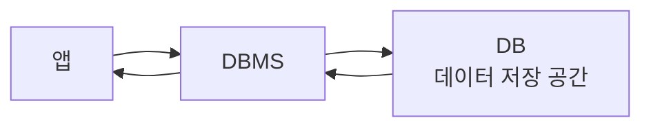
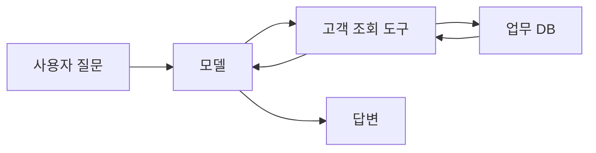

# DB: 데이터를 저장하고 다시 꺼내 쓰는 공간

먼저 결론부터 잡고 가겠습니다.

> **DB란?**
>
> 데이터를 잘 모아두고, 필요할 때 다시 찾고, 고치고, 지울 수 있게 만든 저장 공간입니다.

DB를 알면 데이터를 볼 때 이런 질문을 하게 됩니다.

```text
이 데이터는 어디에 저장될까?
나중에 어떻게 다시 찾을까?
누가 이 데이터를 고칠 수 있을까?
앱이 꺼졌다 켜져도 이 데이터가 남아 있어야 할까?
```

스키마가 "데이터를 어떤 칸과 규칙으로 담을지"를 정하는 생각이라면, DB는 그 데이터를 실제로 모아두고 다시 꺼내 쓰는 공간입니다.

## DB는 왜 필요할까?

작은 실습에서는 데이터를 코드 안에 바로 적어둘 수도 있습니다.

```python
customers = [
    {"name": "김철수", "grade": "VIP"},
    {"name": "이영희", "grade": "Basic"}
]
```

이 정도는 처음 배울 때 괜찮습니다. 하지만 실제 서비스에서는 곧 문제가 생깁니다.

```text
데이터가 너무 많아진다.
여러 사람이 동시에 데이터를 쓴다.
앱을 껐다 켜도 데이터가 남아 있어야 한다.
원하는 조건으로 빠르게 찾아야 한다.
아무나 개인정보를 보면 안 된다.
```

그래서 데이터를 코드 안에 대충 넣어두는 대신, DB에 저장합니다. DB는 데이터를 오래 보관하고, 필요할 때 빠르게 찾고, 안전하게 관리하기 위한 장치입니다.

> **DB를 엑셀로 생각해도 될까?**
>
> 처음에는 엑셀처럼 생각해도 됩니다. 엑셀도 표 모양으로 데이터를 저장하고, 행과 열이 있습니다. 다만 DB는 여러 사람이 동시에 쓰고, 검색과 수정이 많고, 권한과 안정성이 중요한 상황을 더 잘 처리하도록 만들어진 저장소입니다.

## DB와 DBMS

DB와 DBMS는 비슷하게 들리지만 정확히는 다릅니다.

| 용어 | 쉬운 뜻 | 예시 |
| --- | --- | --- |
| DB | 데이터가 모여 있는 저장 공간 | 고객 DB, 주문 DB, 회의록 DB |
| DBMS | DB를 만들고 관리하는 프로그램 | SQLite, PostgreSQL, MySQL |

DB가 자료가 들어 있는 창고라면, DBMS는 그 창고를 관리하는 시스템입니다. 물건을 넣고, 찾고, 고치고, 누가 들어올 수 있는지 관리하는 역할을 합니다.



일상 대화에서는 "DB에 저장한다", "PostgreSQL DB를 쓴다"처럼 DB와 DBMS를 섞어 말하기도 합니다. 처음에는 괜찮습니다. 다만 개념을 정리할 때는 **DB는 데이터 저장 공간, DBMS는 그 저장 공간을 관리하는 프로그램**이라고 나눠두면 좋습니다.

## 표, 행, 열로 보는 DB

가장 익숙한 DB 형태는 표입니다. 관계형 DB에서는 데이터를 테이블로 나누어 저장합니다.

| customer_id | name | grade | city |
| --- | --- | --- | --- |
| 1 | 김철수 | VIP | 서울 |
| 2 | 이영희 | Basic | 부산 |

여기서 용어를 연결해보면 이렇습니다.

| DB 용어 | 쉬운 뜻 | 위 표에서의 예시 |
| --- | --- | --- |
| Table | 데이터를 담는 표 | customers |
| Row | 실제 데이터 한 줄 | 김철수 고객 한 명 |
| Column | 데이터 항목 | name, grade, city |
| Field | 한 칸의 값 | 김철수, VIP, 서울 |
| Primary Key | 한 줄을 구분하는 대표값 | customer_id |

> **Primary Key란?**
>
> Primary key는 각 데이터를 구분하기 위한 대표 번호입니다. 사람 이름은 겹칠 수 있지만 고객번호는 겹치면 안 됩니다. 그래서 `customer_id` 같은 값을 두고 "이 번호로 고객 한 명을 정확히 찾자"라고 약속합니다.

스키마 글과 연결하면, 테이블 이름과 컬럼 이름, 컬럼 타입, 필수 여부, 중복 가능 여부를 정하는 일이 DB 스키마에 가깝습니다.

```text
customers 테이블
- customer_id: 숫자, 비어 있으면 안 됨, 중복되면 안 됨
- name: 문자열
- grade: 문자열
- city: 문자열
```

## DB에서 자주 하는 일

DB에서 자주 하는 일은 크게 네 가지로 볼 수 있습니다.

| 작업 | 쉬운 뜻 | 예시 |
| --- | --- | --- |
| Create | 새 데이터 넣기 | 새 고객 등록 |
| Read | 데이터 조회하기 | VIP 고객 목록 보기 |
| Update | 데이터 고치기 | 고객 등급 변경 |
| Delete | 데이터 삭제하기 | 탈퇴 고객 삭제 |

이 네 가지를 묶어 CRUD라고 부르기도 합니다. 이름은 외우지 않아도 됩니다. 중요한 것은 DB가 단순히 저장만 하는 곳이 아니라, 데이터를 넣고 찾고 고치고 지우는 작업의 중심이라는 점입니다.

SQL을 쓰면 이런 식으로 데이터를 찾을 수 있습니다.

```sql
SELECT name, grade
FROM customers
WHERE city = '서울';
```

이 코드는 "customers 테이블에서 city가 서울인 고객의 name과 grade를 가져와라"라는 뜻입니다. SQL 문법을 지금 외울 필요는 없습니다. 여기서는 DB에 질문을 던져 원하는 데이터를 꺼내올 수 있다는 감각만 잡으면 됩니다.

> **Query란?**
>
> Query는 DB에 던지는 질문이나 요청입니다. "서울 고객만 보여줘", "VIP 고객 수를 세어줘", "이 주문 상태를 배송 완료로 바꿔줘" 같은 요청을 DB가 이해하는 방식으로 표현한 것입니다.

## LangChain에서 DB는 어디에 나올까?

LangChain을 배울 때 DB는 한 가지 의미로만 나오지 않습니다.

첫째, 업무 데이터를 조회할 때 DB가 나옵니다. 예를 들어 사용자가 "김철수 고객의 최근 주문 상태 알려줘"라고 물으면, 모델이 그냥 기억으로 답하면 안 됩니다. 실제 고객 DB나 주문 API에서 데이터를 조회해야 합니다.

이때 모델이 DB에 직접 들어가는 것이 아니라, 보통은 안전하게 만든 도구를 통해 조회합니다.



둘째, 대화 기록이나 작업 상태를 저장할 때 DB가 나옵니다. 앱이 꺼졌다 켜져도 이전 대화나 진행 중인 작업을 이어가려면 어딘가에 저장해야 합니다. 이때 파일, 메모리, DB 같은 저장 방식이 쓰일 수 있습니다.

셋째, RAG에서 문서 조각과 embedding을 저장할 때 Vector DB가 나옵니다. Vector DB는 일반 DB처럼 고객번호를 정확히 찾는 것보다, 질문과 의미가 비슷한 문서 조각을 찾는 데 특화된 저장소입니다. 이 내용은 뒤의 Vector DB와 RAG 글에서 따로 봅니다.

## 연습 :: DB에 어떤 질문을 던질까?

DB는 데이터를 저장하는 곳이기도 하지만, 필요한 데이터를 다시 찾는 곳이기도 합니다. 아래 요청을 보고 DB에 어떤 질문을 던져야 할지 생각해보세요.

```text
서울에 사는 VIP 고객 목록을 보여줘.
```

이 요청을 처리하려면 어떤 정보가 필요할까요?

| 필요한 정보 | 어디에 있을까? |
| --- | --- |
| 고객 이름 |  |
| 고객 등급 |  |
| 고객 지역 |  |

- 예시 보기

    | 필요한 정보 | 어디에 있을까? |
    | --- | --- |
    | 고객 이름 | customers 테이블의 name 컬럼 |
    | 고객 등급 | customers 테이블의 grade 컬럼 |
    | 고객 지역 | customers 테이블의 city 컬럼 |

이 요청을 SQL처럼 표현하면 대략 이런 느낌입니다.

```sql
SELECT name
FROM customers
WHERE city = '서울'
  AND grade = 'VIP';
```

SQL 문법을 정확히 외울 필요는 없습니다. 지금은 "DB에 질문을 던질 때는 어떤 테이블의 어떤 컬럼을 봐야 하는지 생각한다"는 감각이 중요합니다.

## 그래서 요점이 뭔데요?

DB의 요점은 한 문장으로 이렇게 정리할 수 있습니다.

> DB는 데이터를 나중에 다시 쓰기 위해 안전하게 모아두는 공간입니다.

조금 더 풀면 다음과 같습니다.

- 스키마는 데이터를 담는 칸과 규칙이고, DB는 그 데이터를 실제로 저장하고 꺼내 쓰는 공간입니다.
- DBMS는 DB를 만들고, 저장하고, 검색하고, 수정하고, 권한을 관리하는 프로그램입니다.
- 표 형태의 DB에서는 table, row, column, primary key 같은 말을 자주 씁니다.
- DB에서 자주 하는 일은 넣기, 조회하기, 수정하기, 삭제하기입니다.
- LangChain 앱에서 DB는 업무 데이터 조회, 대화 기록 저장, RAG 문서 검색 같은 곳에서 등장합니다.
- 모델이 DB 내용을 자동으로 아는 것은 아닙니다. 안전한 도구나 API로 연결해야 합니다.

그래서 이 글에서 가져가야 할 핵심은 "DB = 어려운 개발자 저장소"가 아닙니다. **DB = 데이터를 오래 보관하고, 필요할 때 정확히 꺼내 쓰기 위한 공간**입니다.

[이전 글](03_스키마_정보를_담는_틀.md) · [다음 글: Entity, Attribute, Relationship](05_DB_Entity_Attribute_Relationship.md)
