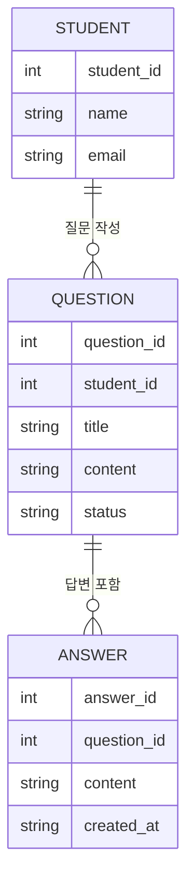
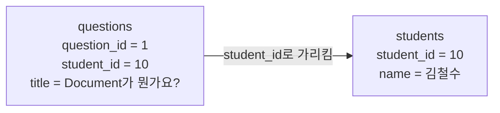
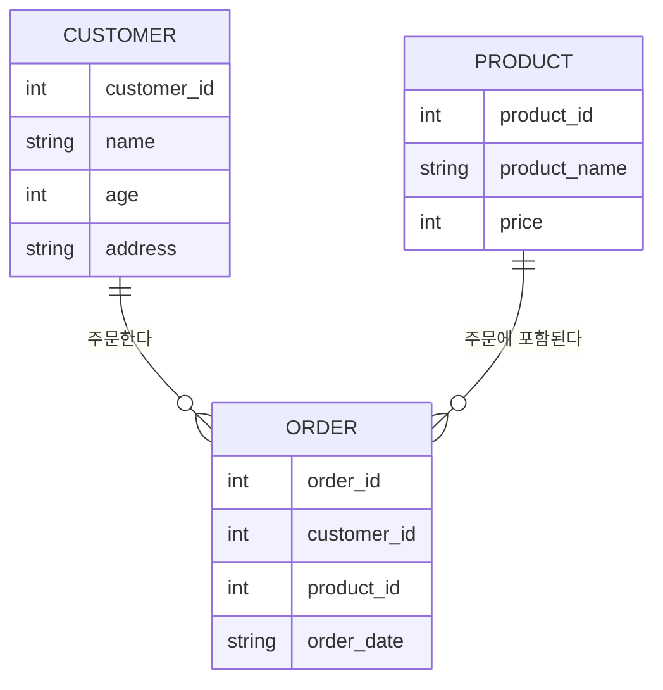
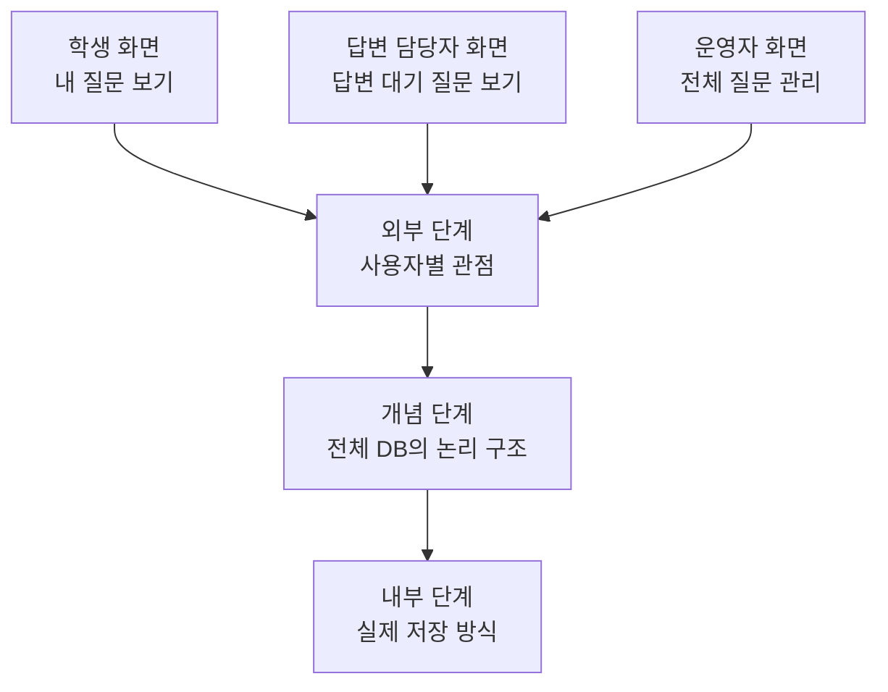

# Entity, Attribute, Relationship: 저장할 대상을 나누어 보는 법

먼저 결론부터 잡고 가겠습니다.

> **Entity, Attribute, Relationship이란?**
>
> Entity는 저장하고 싶은 대상, Attribute는 그 대상이 가진 정보, Relationship은 대상들 사이의 연결입니다.

DB를 설계할 때는 "표를 하나 만들자"에서 바로 시작하기보다, 먼저 이런 질문을 해보면 좋습니다.

```text
무엇을 저장하고 싶은가?
각 대상은 어떤 정보를 가지고 있는가?
대상들은 서로 어떻게 연결되는가?
한 대상이 여러 개의 다른 대상과 연결될 수 있는가?
```

이 질문을 던지는 이유는 간단합니다. 모든 정보를 한 표에 몰아넣으면 처음에는 쉬워 보이지만, 데이터가 많아질수록 반복과 수정 문제가 생기기 쉽습니다.

이 글에서 다루는 내용은 DB 전체에서 완전히 낯선 개념은 아니지만, 특히 **관계형 DB**를 이해할 때 중요합니다. 관계형 DB는 데이터를 여러 표로 나누고, 그 표들을 key로 연결해서 관리하는 방식이기 때문입니다.

## 세 단어 먼저 잡기

| 용어 | 뜻 | 예시 |
| --- | --- | --- |
| Entity | 저장하고 싶은 대상 | 학생, 질문, 답변 |
| Attribute | 대상이 가진 속성 또는 컬럼 | 이름, 제목, 작성일 |
| Relationship | 대상들 사이의 관계 | 학생이 질문을 작성한다 |

> **Entity**
>
> Entity는 DB에 저장하고 싶은 대상입니다. 질문 게시판에서는 학생, 질문, 답변이 각각 entity가 될 수 있습니다. 쇼핑몰에서는 고객, 상품, 주문이 entity가 될 수 있습니다.

> **Attribute**
>
> Attribute는 entity가 가진 정보입니다. 학생 entity에는 이름, 이메일, 가입일 같은 attribute가 붙을 수 있습니다. 질문 entity에는 제목, 내용, 상태, 작성일 같은 attribute가 붙을 수 있습니다. 표로 보면 컬럼에 가깝습니다.

> **Relationship**
>
> Relationship은 entity 사이의 관계입니다. 학생과 질문은 "학생이 질문을 작성한다"로 연결되고, 질문과 답변은 "질문에 답변이 달린다"로 연결됩니다.

## 질문 게시판 예시로 보기

수업 질문 게시판을 만든다고 생각해봅시다.

학생은 질문을 올릴 수 있고, 질문에는 답변이 달릴 수 있습니다.



이 그림은 이렇게 읽으면 됩니다.

```text
학생은 여러 질문을 작성할 수 있다.
질문 하나에는 여러 답변이 달릴 수 있다.
질문은 작성한 학생을 기억해야 한다.
답변은 어떤 질문에 달린 답변인지 기억해야 한다.
```

여기서 `student_id`, `question_id` 같은 번호가 중요해집니다. 이름이나 제목은 겹칠 수 있지만, 번호는 한 대상을 정확히 가리키는 데 쓰입니다.

## 왜 표를 나눌까?

처음에는 질문 게시판 데이터를 한 표에 다 넣고 싶을 수 있습니다.

| 학생명 | 질문 제목 | 질문 내용 | 답변 내용 |
| --- | --- | --- | --- |
| 김철수 | Document가 뭔가요? | metadata가 헷갈립니다 | 문서 조각의 정보입니다 |
| 김철수 | Tool이 뭔가요? | 함수랑 다른가요? | 모델이 호출할 수 있는 기능입니다 |

이 표도 처음에는 읽을 수 있습니다. 하지만 문제가 생깁니다.

```text
학생 이름과 정보가 계속 반복된다.
김철수의 이메일이 바뀌면 여러 줄을 고쳐야 할 수 있다.
답변이 여러 개 달리면 질문 정보가 계속 반복될 수 있다.
질문만 보고 싶을 때와 답변까지 보고 싶을 때를 나누기 어렵다.
```

그래서 보통은 대상을 나눕니다.

```text
students: 학생 정보
questions: 질문 정보
answers: 답변 정보
```

이렇게 나누면 각 표는 자기 역할에 집중할 수 있습니다. 학생 정보는 students에, 질문 내용은 questions에, 답변 내용은 answers에 저장합니다.

## 관계는 번호로 연결한다

표를 나누면 "이 질문을 누가 썼는지", "이 답변이 어떤 질문에 달렸는지"를 연결해야 합니다.

예를 들어 `questions` 테이블에 `student_id`를 넣으면 질문과 학생을 연결할 수 있습니다.

| question_id | student_id | title | status |
| --- | --- | --- | --- |
| 1 | 10 | Document가 뭔가요? | pending |
| 2 | 10 | Tool이 뭔가요? | answered |

여기서 `student_id`가 10인 학생이 두 질문을 작성했다는 뜻입니다.

이때 번호에는 크게 두 가지 역할이 있습니다.

| 용어 | 쉬운 뜻 | 예시 |
| --- | --- | --- |
| Primary Key | 자기 표 안에서 한 줄을 정확히 구분하는 값 | `students.student_id` |
| Foreign Key | 다른 표의 한 줄을 가리키는 값 | `questions.student_id` |

> **Primary Key란?**
>
> Primary key는 자기 표 안에서 데이터를 하나씩 구분하기 위한 대표값입니다. 학생 이름은 같을 수 있지만 `student_id`는 겹치면 안 됩니다.

> **Foreign Key란?**
>
> Foreign key는 다른 테이블의 데이터를 가리키는 값입니다. `questions.student_id`가 `students.student_id`를 가리키면, 질문이 어떤 학생에게 연결되는지 알 수 있습니다. 지금은 "다른 표와 연결하는 번호" 정도로 이해해도 충분합니다.

정리하면 primary key는 "나를 구분하는 번호"이고, foreign key는 "다른 표의 누구와 연결되는지 알려주는 번호"입니다.



## 쇼핑몰 예시로 한 번 더 보기

쇼핑몰에서는 보통 고객, 상품, 주문 데이터를 저장합니다. 고객은 주문을 하고, 주문에는 상품이 포함됩니다.



이 그림은 이렇게 읽으면 됩니다.

```text
고객은 여러 주문을 할 수 있다.
상품은 여러 주문에 포함될 수 있다.
주문은 어떤 고객의 주문인지 알아야 한다.
주문은 어떤 상품이 들어 있는지 알아야 한다.
```

영어 관계명으로 `places`, `included_in`처럼 쓰는 예시도 많지만, 여기서는 `주문한다`, `주문에 포함된다`처럼 문장으로 읽히는 표현이 더 이해하기 쉽습니다.

## 중요한 작업은 묶어서 처리한다

관계형 DB를 배울 때 transaction이라는 말도 자주 나옵니다.

> **Transaction이란?**
>
> Transaction은 여러 DB 작업을 하나의 묶음으로 처리하는 단위입니다. 중간에 하나만 성공하고 하나는 실패하면 문제가 되는 작업에서 중요합니다.

예를 들어 수강 신청을 생각해봅시다.

```text
1. 학생의 신청 내역에 과목을 추가한다.
2. 해당 과목의 남은 자리를 1 줄인다.
```

첫 번째 작업만 성공하고 두 번째 작업이 실패하면 이상해집니다. 학생은 신청한 것처럼 보이는데, 과목의 남은 자리는 줄지 않았기 때문입니다.

그래서 중요한 작업은 보통 이렇게 다루고 싶어집니다.

```text
둘 다 성공하면 저장한다.
하나라도 실패하면 처음 상태로 되돌린다.
```

처음에는 transaction을 "중간에 끊기면 안 되는 DB 작업 묶음" 정도로 이해하면 충분합니다. NoSQL DB에서도 transaction을 지원하는 경우가 있지만, 초반에는 관계형 DB에서 데이터 안전성을 설명할 때 특히 자주 만나는 개념으로 잡아두면 좋습니다.

## 더 깊게 보기: DB를 보는 세 단계

여기부터는 처음 읽을 때 완벽히 이해하지 않아도 됩니다. "DB를 여러 관점에서 볼 수 있구나" 정도만 잡고 넘어가도 충분합니다.

DB는 관점에 따라 세 단계로 나누어 볼 수 있습니다.

```text
외부 단계: 사용자 관점
개념 단계: 조직 전체 관점
내부 단계: 물리적 저장 관점
```

외부 단계는 사용자별 화면이나 필요한 데이터의 모습입니다. 같은 질문 게시판을 쓰더라도 학생은 자기 질문 목록을 보고, 운영자는 전체 질문 상태를 보고, 답변 담당자는 답변이 필요한 질문을 볼 수 있습니다.

개념 단계는 전체 DB의 논리 구조입니다. 질문 게시판 전체를 본다면 학생, 질문, 답변, 카테고리 같은 데이터가 필요하고, 이 데이터들이 서로 어떻게 연결되는지도 정해야 합니다.

내부 단계는 실제 저장 방식입니다. 데이터를 디스크 어디에 저장할지, 검색을 빠르게 하기 위해 인덱스를 만들지 같은 내용입니다. 보통 일반 사용자가 직접 보는 영역은 아닙니다. DBMS가 데이터를 효율적으로 저장하고 찾기 위해 관리하는 구역입니다.



보통 우리가 일반적으로 "DB 스키마"라고 말할 때는 이 개념 단계의 스키마에 가까운 의미로 쓰는 경우가 많습니다.

## 더 깊게 보기: 데이터 독립성

데이터 독립성은 **한쪽 구조가 바뀌어도 다른 쪽에 영향을 최대한 덜 주는 성질**입니다. DB 구조가 조금 바뀔 때마다 사용자 화면이나 프로그램 전체를 다 고쳐야 한다면 너무 불편합니다.

논리적 독립성은 개념 스키마가 바뀌어도 외부 스키마에 영향을 덜 주는 것입니다. 예를 들어 질문 테이블에 `priority` 컬럼이 추가되어도, 학생 화면에서 우선순위를 보여줄 필요가 없다면 기존 학생 화면은 그대로 사용할 수 있습니다.

물리적 독립성은 내부 스키마가 바뀌어도 개념 스키마와 외부 스키마에 영향을 덜 주는 것입니다. 예를 들어 검색 속도를 빠르게 하기 위해 DB에 인덱스를 추가해도, 사용자는 여전히 같은 검색창에서 같은 방식으로 검색합니다.

```text
화면은 그대로인데, 안쪽 저장 방식만 더 빨라질 수 있다.
이런 분리가 잘 되어 있을수록 변경에 강한 시스템이 된다.
```

## 연습 :: 질문 게시판 데이터를 나누어보기

수업 질문 게시판에 아래 데이터가 들어온다고 해봅시다.

```text
작성자: 김철수
제목: LangChain에서 Document가 뭔가요?
내용: page_content랑 metadata가 왜 나뉘는지 모르겠습니다.
상태: 답변 대기
답변: 아직 없음
```

이 데이터를 어떤 entity로 나눌 수 있을까요?

| Entity | 어떤 데이터를 담을까? | Attribute 예시 |
| --- | --- | --- |
| students |  |  |
| questions |  |  |
| answers |  |  |

- 예시 보기

    | Entity | 어떤 데이터를 담을까? | Attribute 예시 |
    | --- | --- | --- |
    | students | 질문을 작성한 학생 정보 | student_id, name |
    | questions | 질문 내용과 상태 | question_id, student_id, title, content, status |
    | answers | 질문에 달린 답변 | answer_id, question_id, content, created_at |

정답을 외우는 것이 목표는 아닙니다. 데이터를 어떤 대상으로 나누면 반복이 줄고, 나중에 찾고 고치기 쉬울지 생각해보는 것이 목표입니다.

## 그래서 요점이 뭔데요?

Entity, Attribute, Relationship의 요점은 한 문장으로 이렇게 정리할 수 있습니다.

> DB 설계는 데이터를 한 표에 다 넣는 일이 아니라, 저장할 대상을 나누고 관계를 정하는 일입니다.

조금 더 풀면 다음과 같습니다.

- Entity는 저장하고 싶은 대상입니다.
- Attribute는 그 대상이 가진 정보입니다.
- Relationship은 대상들 사이의 연결입니다.
- 표를 나누면 반복을 줄이고 데이터를 더 안정적으로 관리할 수 있습니다.
- 표를 나눈 뒤에는 primary key와 foreign key 같은 번호로 서로 연결합니다.
- Transaction은 중간에 끊기면 안 되는 중요한 DB 작업을 하나로 묶는 개념입니다.
- DB를 볼 때는 사용자 화면, 전체 논리 구조, 실제 저장 방식이라는 관점 차이도 있습니다.

그래서 이 글에서 가져가야 할 핵심은 "DB 설계 = 복잡한 그림 그리기"가 아닙니다. **DB 설계 = 데이터를 어떤 대상들로 나누고 어떻게 연결할지 정하는 생각**입니다.

[이전 글](04_DB_데이터를_저장하고_꺼내쓰는_공간.md) · [다음 글: 관계형 DB와 비관계형 DB](06_DB_관계형_DB와_비관계형_DB.md)
