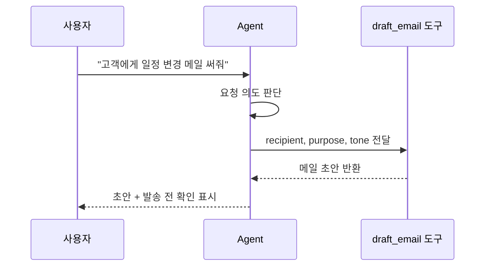

# Tool Calling: 모델이 함수와 API를 쓰게 하는 방식

모델은 문장을 잘 만듭니다. 하지만 오늘의 실제 날씨를 직접 확인하거나, 캘린더를 열거나, 회사 데이터베이스를 조회하거나, 메일을 발송하는 일은 모델 혼자 할 수 없습니다. 이런 일을 하려면 함수나 API가 필요합니다. LangChain에서는 이런 것을 tool로 연결합니다.

도구를 준다는 말은 모델에게 "필요하면 이 함수를 호출해도 된다"고 알려주는 것입니다. 모델은 대화 맥락을 보고 어떤 도구를 어떤 입력값으로 부를지 결정합니다. 실제 실행은 앱이 관리합니다.



예를 들어 메일 초안을 만드는 함수가 있다고 해봅시다.

```python
def draft_email(recipient: str, purpose: str, tone: str) -> str:
    """실제 발송 없이 메일 초안만 작성한다."""
    return f"{recipient}님께 보내는 {tone} 톤의 메일 초안: {purpose}"
```

여기서 아주 중요한 점이 있습니다. 이 도구는 "메일 발송" 도구가 아니라 "메일 초안 작성" 도구입니다. 실제 발송은 위험한 행동입니다. 잘못 보내면 되돌리기 어렵기 때문에 사람의 확인을 받아야 합니다.

도구는 편리하지만 위험할 수도 있습니다. 그래서 도구 이름과 설명이 중요합니다. `메일 관련 함수`처럼 모호하게 설명하면 모델이 언제 써야 하는지 헷갈릴 수 있습니다. `실제 발송 없이 메일 초안만 작성한다`처럼 도구의 한계를 분명히 써주는 편이 안전합니다.

도구는 바뀔 수 있습니다. 오늘은 Python 함수로 만들고, 내일은 외부 API로 바꿀 수도 있습니다. 하지만 오래 가는 원리는 같습니다. 모델이 직접 하지 못하는 일을 안전하게 위임하는 통로, 이것이 tool calling의 핵심입니다.

> #### 이게 뭔데? 함수
> 함수는 입력을 받아 어떤 일을 하고 결과를 돌려주는 코드 묶음입니다. `draft_email("김대리", "회의 변경", "정중한")`처럼 값을 넣으면 메일 초안을 반환하는 식입니다.

> #### 이게 뭔데? 인자와 반환값
> 인자는 함수에 넣는 값입니다. 반환값은 함수가 일을 끝내고 돌려주는 결과입니다. 도구 설계에서는 어떤 인자를 받아야 하는지, 어떤 반환값을 줄지 분명해야 합니다.

> #### 이게 뭔데? API 호출
> API 호출은 외부 서비스에 일을 요청하는 것입니다. 캘린더 API에 일정을 등록하거나, 메일 API에 발송 요청을 보내거나, 사내 DB API에 고객 정보를 요청할 수 있습니다. 실제 변경을 일으키는 API는 특히 조심해야 합니다.

Tool calling을 배울 때 가장 조심해야 할 오해는 "도구가 많을수록 똑똑하다"입니다. 도구가 많으면 모델이 선택을 더 잘못할 수도 있습니다. 좋은 도구는 역할이 좁고 이름과 설명이 분명합니다. 초안 생성 도구, 검색 도구, 할 일 추출 도구처럼 책임이 나뉘어 있어야 합니다.

업무 자동화에서 위험한 도구는 별도로 생각해야 합니다. 메일 발송, 파일 삭제, 결제, 권한 변경처럼 되돌리기 어려운 행동은 모델이 바로 실행하게 만들지 않는 편이 안전합니다. 이런 작업은 사람이 승인하거나, 적어도 한 번 더 확인하는 절차를 둬야 합니다.

[이전 글](04_흐름_체인_에이전트.md) · [다음 글: Vector DB와 RAG](06_DB와_RAG.md)
