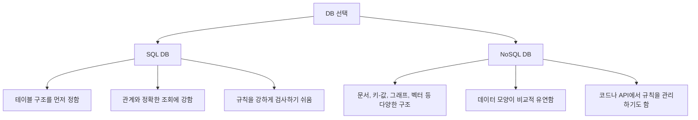

# SQL DB와 NoSQL DB: 엄격한 구조와 유연한 구조

먼저 결론부터 잡고 가겠습니다.

> **SQL DB와 NoSQL DB의 차이는?**
>
> SQL DB는 보통 표 구조와 규칙을 먼저 정하고 데이터를 넣습니다. NoSQL DB는 더 다양한 모양의 데이터를 비교적 유연하게 저장하는 경우가 많습니다.

이 둘을 볼 때는 "어느 쪽이 더 좋다"보다 이런 질문을 해보는 편이 좋습니다.

```text
데이터 구조가 일정한가?
데이터끼리 관계가 중요한가?
데이터가 틀리거나 서로 모순되지 않는 것이 중요한가?
데이터 모양이 자주 바뀌는가?
문서, 로그, JSON 같은 유연한 형태가 더 편한가?
```

## SQL DB는 표 구조를 중요하게 본다

SQL 기반 관계형 DB에서는 보통 스키마를 비교적 엄격하게 정합니다. 고객 테이블을 만든다면 먼저 구조를 정합니다.

```sql
CREATE TABLE customers (
    customer_id INT,
    name VARCHAR(50),
    age INT,
    address TEXT
);
```

이 뜻은 다음과 같습니다.

```text
customer_id는 숫자
name은 문자열
age는 숫자
address는 긴 문자열
```

SQL DB는 보통 스키마를 먼저 정하고 데이터를 넣는 방식입니다. 그래서 고객, 주문, 결제처럼 구조가 중요하고 정확한 조회가 필요한 데이터에 잘 어울립니다.


> **SQL이란?**
>
> SQL은 DB에 질문하거나 요청할 때 쓰는 언어입니다. "이 조건에 맞는 고객을 보여줘", "이 주문 상태를 바꿔줘" 같은 요청을 DB가 이해할 수 있는 문장으로 쓰는 방식입니다.

## NoSQL DB는 더 유연한 구조를 쓴다

NoSQL DB에도 스키마가 있을 수 있습니다. 다만 SQL DB처럼 항상 딱딱하게 강제되는 것은 아닙니다.

예를 들어 문서형 DB에서는 JSON과 비슷한 형태로 데이터를 저장할 수 있습니다.

```json
{
  "name": "김철수",
  "age": 25,
  "address": "서울"
}
```

같은 컬렉션 안에 이런 데이터도 들어갈 수 있습니다.

```json
{
  "name": "이영희",
  "phone": "010-1111-2222"
}
```

그래서 NoSQL DB를 흔히 schema-less라고 부릅니다. 하지만 스키마가 아예 없다기보다는, **스키마를 더 유연하게 다루는 경우가 많다**고 보는 편이 좋습니다. 실무에서는 NoSQL을 사용하더라도 코드, API, 문서, 검증 로직을 통해 데이터 구조를 정해두는 경우가 많습니다.

> **schema-less가 정말 스키마가 없다는 뜻일까?**
>
> 완전히 아무 규칙도 없다는 뜻으로 받아들이면 위험합니다. 저장소가 강하게 막지 않을 뿐, 앱이 데이터를 안정적으로 쓰려면 결국 어떤 필드가 들어올지, 어떤 타입인지, 어떤 값이 필요한지 약속해야 합니다.

## SQL DB와 NoSQL DB 비교

| 구분 | SQL DB | NoSQL DB |
| --- | --- | --- |
| 기본 모양 | 테이블, 행, 열 | 문서, 키-값, 그래프, 벡터 등 |
| 구조 | 비교적 엄격함 | 비교적 유연함 |
| 잘 맞는 상황 | 주문, 결제, 회원, 재고 | 로그, 문서, 설정, 빠르게 변하는 데이터 |
| 조회 방식 | SQL 중심 | 제품마다 다름 |
| 스키마 | DB에서 강하게 관리하는 경우가 많음 | 앱 코드나 API에서 관리하는 경우도 많음 |



## 어떤 것이 더 좋은가?

SQL DB와 NoSQL DB는 좋고 나쁨의 문제가 아닙니다. 데이터 성격과 앱의 목적에 따라 선택이 달라집니다.

예를 들어 결제 내역은 정확성이 아주 중요합니다. 누가 얼마를 결제했는지, 어떤 주문과 연결되는지 틀리면 안 됩니다. 이런 데이터는 SQL DB가 잘 맞는 경우가 많습니다.

반대로 사용자의 활동 로그나 문서 조각처럼 데이터 모양이 자주 바뀌거나, 저장 형태가 다양할 수 있는 경우에는 NoSQL 계열이 편할 수 있습니다.

처음 배우는 단계에서는 제품 이름을 외우기보다 이렇게만 잡아도 충분합니다.

```text
SQL DB: 표와 관계, 정확한 규칙에 강함
NoSQL DB: 다양한 데이터 모양과 유연한 저장에 강함
```

## LangChain에서는 왜 이 구분이 필요할까?

LangChain을 배울 때는 일반 DB와 Vector DB를 구분해야 합니다.

일반 DB는 정확한 값을 찾는 데 강합니다.

```text
김철수 고객의 최근 주문 상태
2026년 6월 결제 내역
답변 대기 상태인 질문 목록
```

Vector DB는 의미가 비슷한 문서를 찾는 데 강합니다.

```text
환불 규정과 관련된 회의록
Document 개념을 설명하는 강의자료
Tool calling과 비슷한 질문
```

Vector DB는 NoSQL 계열 저장소처럼 다루어지는 경우가 많지만, 핵심은 제품 분류보다 **의미 기반 검색을 위한 저장소**라는 점입니다. 다음 RAG 글에서는 이 Vector DB가 문서 검색에 어떻게 쓰이는지 봅니다.

## 연습 :: 어떤 DB가 더 어울릴까?

아래 데이터는 SQL DB와 NoSQL DB 중 어느 쪽이 더 어울릴지 생각해보세요. 정답이 하나로만 정해지는 것은 아니지만, 이유를 설명해보는 것이 중요합니다.

| 데이터 | 더 어울릴 것 같은 방식 | 이유 |
| --- | --- | --- |
| 주문 결제 내역 |  |  |
| 사용자 활동 로그 |  |  |
| 질문 게시판의 질문/답변 |  |  |
| PDF 문서 조각과 임베딩(문서 의미를 숫자로 바꾼 값) |  |  |

- 예시 보기

    | 데이터 | 더 어울릴 것 같은 방식 | 이유 |
    | --- | --- | --- |
    | 주문 결제 내역 | SQL DB | 정확한 금액, 주문, 결제 관계가 중요함 |
    | 사용자 활동 로그 | NoSQL DB | 데이터 모양이 자주 바뀔 수 있음 |
    | 질문 게시판의 질문/답변 | SQL DB | 학생, 질문, 답변 관계를 관리하기 좋음 |
    | PDF 문서 조각과 임베딩(문서 의미를 숫자로 바꾼 값) | Vector DB | 의미가 비슷한 문서 조각을 찾아야 함 |

## 그래서 요점이 뭔데요?

SQL DB와 NoSQL DB의 요점은 한 문장으로 이렇게 정리할 수 있습니다.

> SQL DB와 NoSQL DB의 차이는 데이터를 얼마나 엄격한 구조로 관리할지, 얼마나 유연한 형태로 저장할지의 차이입니다.

조금 더 풀면 다음과 같습니다.

- SQL DB는 테이블 구조와 관계를 중요하게 봅니다.
- NoSQL DB는 문서, 키-값, 그래프, 벡터처럼 다양한 데이터 모양을 다룰 수 있습니다.
- NoSQL이 스키마를 전혀 안 쓴다는 뜻은 아닙니다.
- 정확한 값 조회가 중요하면 일반 DB가 필요하고, 의미가 비슷한 문서 검색이 중요하면 Vector DB가 필요할 수 있습니다.
- LangChain의 RAG를 이해하려면 일반 DB와 Vector DB의 차이를 구분하는 것이 중요합니다.

그래서 이 글에서 가져가야 할 핵심은 "SQL과 NoSQL 제품명을 외우기"가 아닙니다. **데이터 성격에 따라 저장 방식이 달라진다는 감각**입니다.

[이전 글](05_DB_Entity_Attribute_Relationship.md) · [다음 글: 메시지와 프롬프트](07_메시지와_프롬프트.md)
