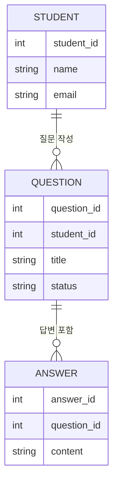
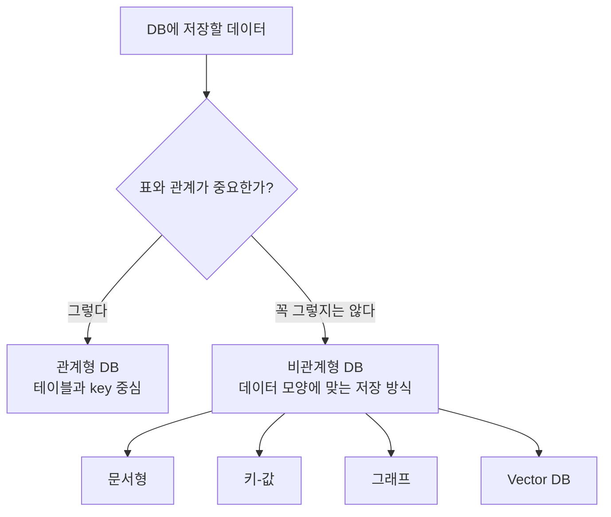

# 관계형 DB와 비관계형 DB: 표로 연결할까, 다른 모양으로 저장할까

먼저 결론부터 잡고 가겠습니다.

> **관계형 DB와 비관계형 DB의 차이는?**
>
> 관계형 DB는 데이터를 표로 나누고 표 사이의 관계를 key로 연결하는 방식입니다. 비관계형 DB는 꼭 표와 관계 중심이 아니라, 데이터의 성격에 맞게 문서, 키-값, 그래프, 벡터 같은 다양한 모양으로 저장하는 방식입니다.

이 글에서 목표는 DB 제품을 외우는 것이 아닙니다. 아래 감각을 잡는 것입니다.

```text
관계형 DB: 잘 정리된 여러 표를 연결해서 쓴다.
비관계형 DB: 데이터 모양에 맞춰 표 말고 다른 방식도 쓴다.
```

## 이름부터 정리하기

DB를 공부하다 보면 관계형 DB, 비관계형 DB, SQL DB, NoSQL DB라는 말이 같이 나옵니다.

처음에는 이렇게 묶어서 이해하면 됩니다.

| 표현 | 처음에는 이렇게 이해하세요 |
| --- | --- |
| 관계형 DB | 테이블과 관계를 중심으로 데이터를 관리하는 DB |
| SQL DB | SQL이라는 언어로 조회하는 관계형 DB를 가리키는 경우가 많음 |
| 비관계형 DB | 꼭 테이블 관계 중심이 아닌 다양한 저장 방식을 쓰는 DB |
| NoSQL DB | 비관계형 DB 계열을 넓게 부르는 말 |

정확히 들어가면 예외와 세부 분류가 있지만, 이 자료에서는 다음 정도로 잡아도 충분합니다.

```text
관계형 DB ≒ SQL DB
비관계형 DB ≒ NoSQL DB
```

다만 `SQL`은 원래 DB에 질문하는 언어 이름이고, `NoSQL`은 하나의 제품명이 아니라 여러 저장 방식을 넓게 묶어 부르는 말입니다.

## 관계형 DB는 표를 나누고 연결한다

관계형 DB는 데이터를 테이블로 나누어 저장합니다. 그리고 테이블 사이의 관계를 key로 연결합니다.

질문 게시판을 다시 떠올려봅시다.

```text
students: 학생 정보
questions: 질문 정보
answers: 답변 정보
```

이렇게 나누면 학생 정보, 질문 내용, 답변 내용을 각자 알맞은 표에 저장할 수 있습니다.



관계형 DB에서는 이런 질문을 자주 던집니다.

```text
어떤 학생이 어떤 질문을 작성했는가?
답변 대기 상태인 질문은 무엇인가?
특정 질문에 달린 답변은 무엇인가?
```

SQL로 쓰면 대략 이런 느낌입니다.

```sql
SELECT title, status
FROM questions
WHERE student_id = 10;
```

지금 SQL 문법을 외울 필요는 없습니다. 중요한 것은 관계형 DB가 **표, key, 관계, 정확한 조회**를 중요하게 본다는 점입니다.

## 비관계형 DB는 데이터 모양에 맞게 저장한다

비관계형 DB는 "항상 테이블로 나누고 관계로 연결해야 한다"는 생각에서 조금 벗어납니다.

데이터의 성격에 따라 더 편한 모양을 고릅니다.

| 종류 | 쉬운 설명 | 예시 |
| --- | --- | --- |
| 문서형 DB | JSON처럼 생긴 문서를 저장 | 사용자 프로필, 설정값, 게시글 |
| 키-값 DB | key로 값을 바로 찾음 | 캐시, 세션, 임시 저장 |
| 그래프 DB | 점과 선으로 관계를 저장 | 친구 관계, 추천 관계 |
| Vector DB | 의미를 숫자 벡터로 저장하고 비슷한 내용을 찾음 | RAG 문서 검색 |

문서형 DB에서는 이런 식으로 한 덩어리의 데이터를 저장할 수 있습니다.

```json
{
  "name": "김철수",
  "email": "kim@example.com",
  "recent_questions": [
    {
      "title": "Document가 뭔가요?",
      "status": "답변 대기"
    }
  ]
}
```

이런 형태는 표를 여러 개로 나누는 것보다 한 사람의 관련 정보를 한 문서 안에 담아두는 편이 자연스러울 때가 있습니다.

NoSQL DB를 흔히 schema-less라고 부르기도 합니다. 하지만 이것을 "스키마가 아예 없다"로 이해하면 위험합니다.

> **schema-less는 무규칙이라는 뜻이 아닙니다.**
>
> DB가 구조를 강하게 막지 않을 뿐, 앱이 데이터를 안정적으로 쓰려면 결국 어떤 필드가 들어올지, 어떤 타입인지, 어떤 값이 필요한지 약속해야 합니다.

## 앞에서 본 개념들은 어디에 붙을까?

`key`, `query`, `index`, `transaction`은 관계형 DB에서만 쓰이는 말은 아닙니다. 다만 어디에서 더 중요하게 다루는지는 조금 다릅니다.

| 개념 | DB 전반에서 쓰이나요? | 처음 배울 때의 위치 |
| --- | --- | --- |
| Query | 거의 모든 DB에서 등장 | DB 공통 개념 |
| Index | 거의 모든 DB에서 등장 | DB 공통 개념 |
| Primary Key | 비슷한 개념이 여러 DB에 있음 | 관계형 DB에서 자세히 |
| Foreign Key | 관계형 DB에서 특히 중요 | 관계형 DB에서 자세히 |
| Transaction | 여러 DB에서 지원 가능 | 관계형 DB의 데이터 안전성에서 먼저 |
| Schema | 모든 DB에서 넓게 필요 | SQL DB는 엄격, NoSQL DB는 유연한 경우가 많음 |

그래서 이 자료에서는 이렇게 나누어 이해하면 됩니다.

```text
Query와 Index: DB 공통 감각
Primary Key와 Foreign Key: 관계형 DB에서 특히 중요한 연결 방식
Transaction: 중요한 작업을 안전하게 묶는 개념
Schema: 모든 DB에서 필요하지만 강제 방식은 다를 수 있음
```

## 관계형과 비관계형을 비교해보면

| 구분 | 관계형 DB | 비관계형 DB |
| --- | --- | --- |
| 기본 모양 | 테이블, 행, 열 | 문서, 키-값, 그래프, 벡터 등 |
| 핵심 생각 | 데이터를 나누고 관계로 연결 | 데이터 성격에 맞는 모양으로 저장 |
| 구조 | 비교적 엄격한 편 | 비교적 유연한 편 |
| 잘 맞는 예 | 회원, 주문, 결제, 재고 | 로그, 설정, 문서, 의미 검색 |
| 자주 보는 말 | table, row, column, primary key, foreign key, SQL | collection, document, key-value, vector, metadata |



둘 중 하나가 무조건 더 좋은 것은 아닙니다. 데이터 성격에 따라 어울리는 방식이 달라집니다.

결제 내역처럼 정확성과 관계가 중요한 데이터는 관계형 DB가 잘 맞는 경우가 많습니다. 반대로 문서 조각, 로그, 설정값처럼 모양이 다양하거나 자주 바뀌는 데이터는 비관계형 DB가 편할 수 있습니다.

## LangChain에서는 왜 이 구분이 필요할까?

LangChain을 배울 때 이 구분이 중요한 이유는 Vector DB 때문입니다.

일반 업무 데이터는 관계형 DB에 들어 있는 경우가 많습니다.

```text
김철수 고객의 최근 주문 상태
2026년 6월 결제 내역
답변 대기 상태인 질문 목록
```

이런 데이터는 정확한 값과 관계가 중요합니다.

반면 RAG에서 쓰는 문서 검색은 조금 다릅니다.

```text
환불 규정과 관련된 회의록
Document 개념을 설명하는 강의자료
Tool calling과 비슷한 질문
```

이런 요청은 정확히 같은 단어를 찾는 것보다, 의미가 비슷한 문서 조각을 찾는 일이 중요합니다. 그래서 Vector DB가 등장합니다.

정리하면 LangChain에서는 둘 다 만날 수 있습니다.

```text
업무 데이터 조회: 관계형 DB나 업무 API
문서 근거 검색: Vector DB
대화 기록과 상태 저장: 파일, 메모리, DB 등 상황에 따라 선택
```

## 연습 :: 어떤 저장 방식이 더 자연스러울까?

아래 데이터는 관계형 DB와 비관계형 DB 중 어느 쪽 감각에 더 가까울지 생각해보세요. 정답이 하나로만 정해지는 것은 아니지만, 이유를 설명해보는 것이 중요합니다.

| 데이터 | 더 가까운 감각 | 이유 |
| --- | --- | --- |
| 주문 결제 내역 |  |  |
| 사용자 활동 로그 |  |  |
| 질문 게시판의 학생/질문/답변 |  |  |
| PDF 문서 조각과 임베딩 |  |  |

- 예시 보기

    | 데이터 | 더 가까운 감각 | 이유 |
    | --- | --- | --- |
    | 주문 결제 내역 | 관계형 DB | 주문, 결제, 금액, 상태의 정확한 관계가 중요함 |
    | 사용자 활동 로그 | 비관계형 DB | 이벤트 종류에 따라 데이터 모양이 달라질 수 있음 |
    | 질문 게시판의 학생/질문/답변 | 관계형 DB | 학생, 질문, 답변을 나누고 연결하기 좋음 |
    | PDF 문서 조각과 임베딩 | Vector DB | 의미가 비슷한 문서 조각을 찾아야 함 |

## 그래서 요점이 뭔데요?

관계형 DB와 비관계형 DB의 요점은 한 문장으로 이렇게 정리할 수 있습니다.

> 관계형 DB는 표를 나누고 연결해서 관리하는 방식이고, 비관계형 DB는 데이터 성격에 맞춰 더 다양한 모양으로 저장하는 방식입니다.

조금 더 풀면 다음과 같습니다.

- 관계형 DB는 table, row, column, key, relationship을 중요하게 봅니다.
- SQL DB는 관계형 DB를 가리키는 말로 많이 쓰이고, SQL은 DB에 질문하는 언어입니다.
- 비관계형 DB는 문서형, 키-값, 그래프, Vector DB처럼 여러 방식이 있습니다.
- NoSQL이 스키마가 아예 없다는 뜻은 아닙니다. 스키마를 더 유연하게 다루는 경우가 많다는 뜻에 가깝습니다.
- Query와 Index는 DB 전반에서 쓰이고, Primary Key와 Foreign Key는 관계형 DB에서 특히 중요합니다.
- LangChain에서는 업무 데이터 조회와 RAG 문서 검색이 서로 다른 DB 감각을 요구할 수 있습니다.

그래서 이 글에서 가져가야 할 핵심은 "DB 종류를 많이 외우기"가 아닙니다. **데이터가 어떤 모양이고 어떤 방식으로 찾아야 하는지에 따라 저장 방식이 달라진다는 감각**입니다.

[이전 글](05_DB_Entity_Attribute_Relationship.md) · [다음 글: 메시지와 프롬프트](07_메시지와_프롬프트.md)
