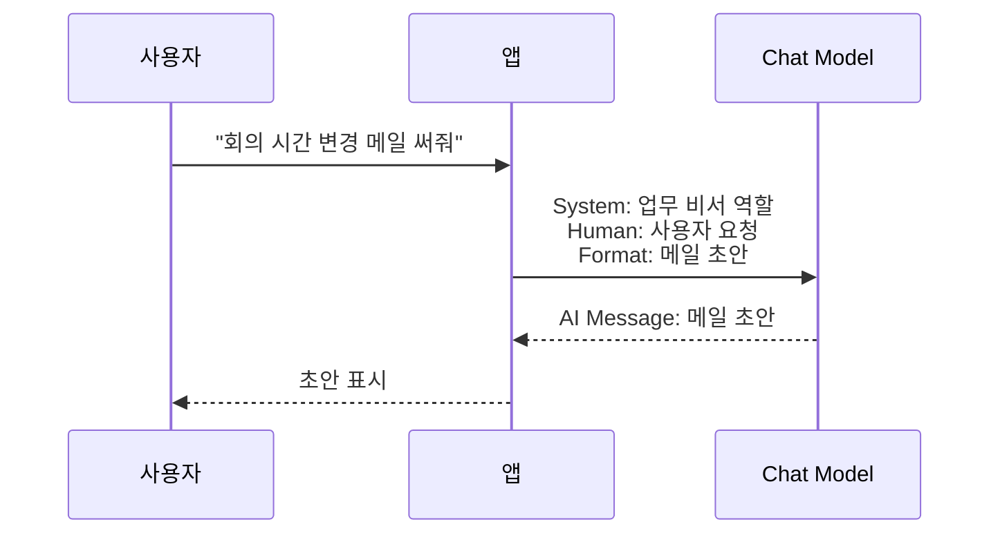

# 메시지와 프롬프트: 모델에게 일을 시키는 말의 구조

LLM을 처음 접하면 "프롬프트를 잘 써야 한다"는 말을 많이 듣습니다. 맞는 말입니다. 하지만 LangChain을 이해하려면 프롬프트보다 먼저 메시지 구조를 보는 편이 좋습니다.

모델에게는 단순히 긴 글 하나를 던지는 것이 아니라, 역할이 나뉜 메시지 목록을 줄 수 있습니다. 이 역할 구분이 LLM 앱의 기본 문법입니다.

System message는 모델에게 역할과 규칙을 알려줍니다. Human message는 사용자의 요청입니다. AI message는 모델이 이전에 답한 내용입니다. Tool message는 도구를 실행한 결과를 모델에게 다시 알려주는 메시지입니다.

예를 들어 아래처럼 볼 수 있습니다.

```python
messages = [
    {"role": "system", "content": "너는 업무 메일 초안을 작성하는 비서다."},
    {"role": "user", "content": "고객에게 회의 시간이 변경됐다고 알려줘."},
]
```

여기서 system message는 모델의 태도와 규칙을 잡습니다. 같은 사용자 요청이라도 system message가 "초보자에게 설명하는 선생님"인지, "업무 비서"인지, "보안 검토자"인지에 따라 답변 방향이 달라집니다.



프롬프트는 여기서 "모델에게 줄 지시와 맥락을 어떻게 구성할 것인가"에 가깝습니다. 프롬프트를 잘 쓴다는 것은 멋진 문장을 쓰는 일이 아닙니다. 모델이 해야 할 일, 참고해야 할 자료, 지켜야 할 제한, 원하는 출력 형식을 분명히 알려주는 일입니다.

예를 들어 "메일 써줘"보다 아래 지시가 훨씬 안정적입니다.

```text
너는 업무 메일 초안을 작성하는 비서다.
사용자의 요청을 바탕으로 정중한 한국어 메일 초안을 작성하라.
실제 발송은 하지 말고, 발송 전 확인이 필요하다고 표시하라.
```

이때 context라는 말도 자주 나옵니다. context는 모델이 이번 답변을 만들 때 참고할 수 있는 주변 정보입니다. 이전 대화, 검색된 문서, 사용자 설정, 도구 실행 결과가 모두 context가 될 수 있습니다.

문제는 context window입니다. 모델이 한 번에 볼 수 있는 정보량에는 한계가 있습니다. 책상 위에 올릴 수 있는 종이의 양이 제한되어 있다고 생각하면 됩니다. 그래서 모든 자료를 다 넣는 것이 아니라, 이번 답변에 필요한 정보를 골라 넣어야 합니다.

> #### 이게 뭔데? Token
> 토큰은 모델이 텍스트를 처리하는 작은 단위입니다. 한국어 한 글자와 정확히 같지는 않습니다. 중요한 점은 모델 사용량과 context window가 보통 토큰 기준으로 계산된다는 것입니다.

> #### 이게 뭔데? Context Window
> 모델이 한 번에 볼 수 있는 정보량의 한계입니다. 긴 회의록 100개를 한 번에 다 넣을 수 없기 때문에, 필요한 부분을 검색하거나 요약해서 넣는 방식이 필요합니다.

> #### 이게 뭔데? System Message
> system message는 모델에게 역할과 규칙을 알려주는 메시지입니다. 하지만 절대적인 안전장치는 아닙니다. 모델이 항상 완벽히 지킨다고 믿기보다, 출력 검증과 평가를 함께 두는 편이 안전합니다.

메시지와 프롬프트는 뒤의 모든 개념과 연결됩니다. 도구를 호출할 때도 모델은 메시지를 보고 판단합니다. RAG도 검색된 문서를 context로 넣는 방식입니다. 메모리도 이전 메시지를 어떻게 다시 넣을지의 문제입니다.

[이전 글](06_DB_관계형_DB와_비관계형_DB.md) · [다음 글: 흐름, Chain, Runnable, Agent](08_흐름_체인_에이전트.md)
