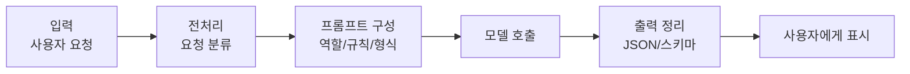
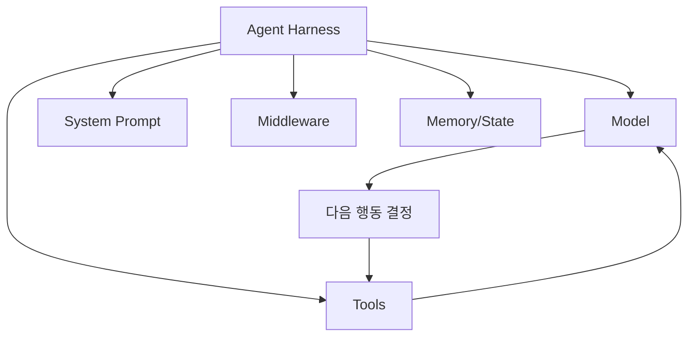

# 흐름, Chain, Runnable, Agent: LLM 앱은 단계로 움직인다

모델 한 번 호출해서 답을 받는 코드는 간단합니다. 하지만 실제 앱에서는 그 앞뒤가 더 중요해지는 경우가 많습니다.

사용자의 말을 정리해야 합니다. 어떤 업무인지 분류해야 합니다. 프롬프트를 구성해야 합니다. 필요한 경우 문서를 검색해야 합니다. 모델을 호출해야 합니다. 결과가 JSON 같은 정해진 형식인지 확인해야 합니다. 문제가 있으면 다시 고쳐야 합니다.

이런 식으로 생각하면 LangChain의 chain, runnable, agent 같은 말이 조금 덜 낯설어집니다.

Chain은 여러 단계를 연결한 흐름입니다. Runnable은 실행 가능한 작은 부품입니다. Agent는 모델이 상황을 보고 다음 행동을 고르는 실행 흐름입니다. Harness는 모델이 작업을 수행하도록 둘러싼 실행 틀입니다.

예전 자료에서는 `LLMChain` 같은 클래스를 많이 볼 수 있고, 최신 LangChain 문서에서는 `create_agent`를 중심으로 설명하는 흐름이 강합니다. 여기서 중요한 것은 어느 클래스 이름을 외우느냐가 아닙니다. 입력부터 출력까지 흐름을 나누는 감각입니다.

agent는 chain보다 조금 더 능동적인 구조입니다. 정해진 순서로만 움직이는 것이 아니라, 모델이 "지금 검색이 필요한가?", "도구를 호출해야 하나?", "그냥 답해도 되나?"를 판단합니다. 공식 문서에서도 agent를 모델이 도구를 반복 호출하면서 과업을 완료하는 loop로 설명합니다.

Harness는 agent loop 주변의 실행 틀입니다. 모델, 도구, system prompt, middleware, memory가 이 틀 안에서 함께 작동합니다. 최신 LangChain의 `create_agent`는 이 harness를 만드는 진입점으로 이해하면 됩니다.

Middleware는 중간에 끼어드는 장치입니다. 예를 들어 너무 긴 대화는 요약하고, 위험한 도구 호출은 막고, 특정 조건에서는 사람의 승인을 받게 만들 수 있습니다. middleware 구현법은 나중에 바뀔 수 있지만, "agent 주변에서 행동을 조절하는 장치"라는 개념은 오래 갑니다.

> #### 이게 뭔데? invoke와 stream
> `invoke`는 입력을 넣고 최종 결과를 받는 실행 방식입니다. `stream`은 중간중간의 진행 결과를 흘려받는 방식입니다. 답변이 길거나 도구 호출이 여러 번 일어나는 앱에서는 stream이 사용자 경험을 좋게 만들 수 있습니다.

> #### 이게 뭔데? Runnable
> Runnable은 "실행할 수 있는 부품" 정도로 생각하면 됩니다. 입력을 받아 출력을 내는 작은 처리 단위입니다. 초보 단계에서는 문법보다 "작은 실행 단위를 연결한다"는 생각이 중요합니다.

> #### 이게 뭔데? LangGraph
> LangGraph는 더 복잡한 상태 기반 흐름을 직접 설계할 때 쓰이는 도구입니다. LangChain agent는 LangGraph 위에서 동작하는 부분이 많지만, 처음부터 LangGraph를 깊게 알아야 LangChain을 쓸 수 있는 것은 아닙니다.

정리하면 이렇습니다. Chain은 정해진 절차를 잘 연결하는 감각이고, agent는 모델이 다음 행동을 고르는 감각입니다. 둘 중 하나만 무조건 좋은 것이 아니라, 앱의 성격에 따라 적절한 구조가 달라집니다.

[이전 글](07_메시지와_프롬프트.md) · [다음 글: Tool Calling](09_Tool_Calling.md)
