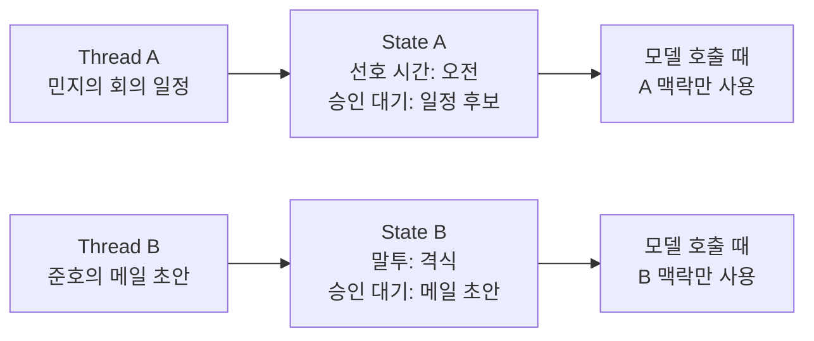

# Memory, Thread, State: 대화를 이어가는 법

AI가 이전 대화를 기억하는 것처럼 보일 때가 있습니다. 하지만 개발 관점에서는 모델이 스스로 모든 것을 기억한다고 보면 안 됩니다. 앱이 이전 메시지나 요약, 사용자 설정을 저장해두었다가 다음 모델 호출 때 다시 넣어주는 구조에 가깝습니다.

여기서 thread와 state가 중요해집니다.

Thread는 하나로 이어지는 대화 묶음입니다. State는 지금까지의 작업 상황을 담은 현재 상태표입니다. 예를 들어 사용자의 이름, 선호 시간, 보류 중인 메일 초안, 이전에 검색한 문서 같은 정보가 state에 들어갈 수 있습니다.

두 사람의 대화가 섞이면 문제가 생깁니다. 민지의 선호 시간이 준호의 메일 초안에 반영되면 이상한 답이 나오겠죠. 그래서 thread를 분리하고 state를 관리해야 합니다.

그렇다고 모든 대화를 계속 넣으면 좋을까요? 그렇지 않습니다. 모델이 한 번에 볼 수 있는 context window에는 한계가 있고, 오래된 정보가 많아질수록 모델이 산만해질 수 있습니다. 그래서 필요 없는 메시지는 줄이고, 중요한 내용은 요약하고, 반드시 필요한 상태만 남기는 전략이 필요합니다.

> #### 이게 뭔데? Memory
> memory는 모델의 머릿속 기억이 아니라 앱이 저장해두었다가 다시 넣어주는 맥락입니다. 이전 메시지 전체일 수도 있고, 요약본일 수도 있고, 사용자 선호 설정일 수도 있습니다.

> #### 이게 뭔데? Thread ID
> thread ID는 대화 묶음을 구분하는 이름표입니다. 같은 사람이 이어서 질문할 때는 같은 thread ID를 써야 대화가 이어지고, 다른 사람의 대화와 섞이지 않습니다.

> #### 이게 뭔데? Checkpointer
> 상태를 저장해 나중에 이어서 볼 수 있게 하는 저장 장치입니다. 로컬 실습에서는 메모리에 저장할 수도 있고, 실제 서비스에서는 DB에 저장할 수도 있습니다.

Memory는 모든 것을 기억하는 장치가 아닙니다. 필요한 것을 필요한 시점에 다시 꺼내 쓰기 위한 상태 관리입니다. 이 관점이 잡히면 "모델이 기억한다"와 "앱이 기억하게 만든다"를 구분할 수 있습니다.

[이전 글](10_Vector_DB와_RAG.md) · [다음 글: Structured Output](12_Structured_Output.md)
