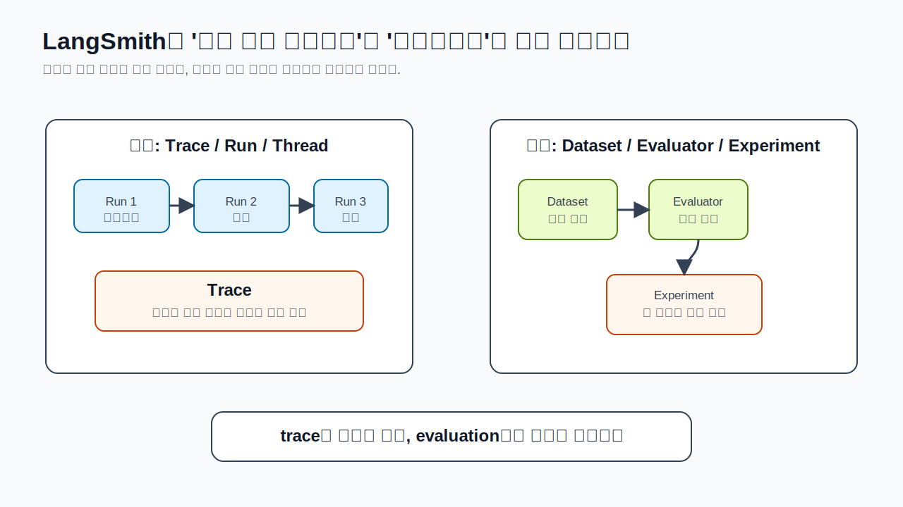
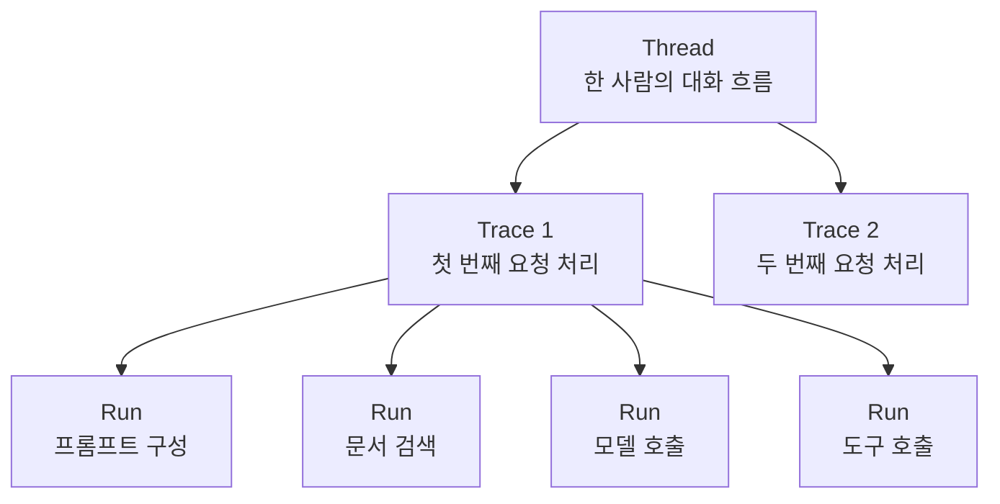

# LangSmith Trace: 답이 틀린 원인을 찾는 법

LLM 앱이 이상한 답을 했을 때 "모델이 틀렸다"로 끝내면 고칠 수 없습니다. 실제로는 여러 단계 중 하나가 문제였을 수 있습니다. 질문 해석이 틀렸을 수도 있고, 검색된 문서가 엉뚱했을 수도 있고, 도구 입력값이 잘못됐을 수도 있고, 모델이 근거를 잘못 요약했을 수도 있습니다.

LangSmith는 이 과정을 trace와 run으로 보여줍니다.

Trace는 사용자 요청 하나를 처리한 전체 기록입니다. Run은 trace 안의 작은 실행 단계입니다. 프롬프트 구성, 문서 검색, 모델 호출, 도구 호출이 각각 run이 될 수 있습니다. Thread는 여러 trace를 하나의 대화 흐름으로 묶은 것입니다.

예를 들어 사용자가 이렇게 물었다고 합시다.

> 지난주 회의록 요약해서 고객에게 보낼 메일 초안 만들어줘.

그런데 최종 답변이 휴가 신청 안내 메일처럼 나왔습니다. 최종 답만 보면 모델이 이상한 소리를 한 것처럼 보입니다. 하지만 trace를 보면 검색 단계에서 휴가 규정 문서가 잘못 검색되었을 수도 있습니다. 이 경우 고쳐야 할 곳은 모델의 말투가 아니라 retrieval입니다.

> #### 이게 뭔데? Observability
> observability는 시스템 안에서 무슨 일이 일어났는지 볼 수 있게 만드는 능력입니다. LLM 앱에서는 최종 답만 보는 것이 아니라 프롬프트, 검색 결과, 도구 호출, 모델 응답을 함께 봐야 합니다.

> #### 이게 뭔데? Metadata와 Tag
> metadata와 tag는 실행 기록에 붙이는 이름표입니다. 모델명, 프롬프트 버전, 실습 이름, 사용자 유형 같은 정보를 붙여두면 나중에 비슷한 실행을 검색하고 비교하기 쉽습니다.

> #### 이게 뭔데? Latency
> latency는 실행에 걸린 시간입니다. 모델 답이 맞더라도 너무 오래 걸리면 실제 앱에서는 문제가 될 수 있습니다.

LangSmith를 쓰는 이유는 단순히 화면에서 결과를 예쁘게 보기 위해서가 아닙니다. 앱이 어떤 경로로 그 답에 도달했는지 보고, 고쳐야 할 지점을 찾기 위해서입니다.

[이전 글](12_Structured_Output.md) · [다음 글: LangSmith Evaluation](14_LangSmith_Evaluation.md)
