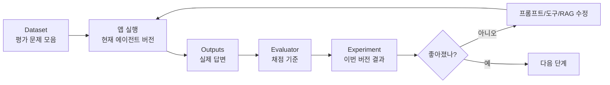

# LangSmith Evaluation: 좋아졌는지 기준으로 확인하는 법

AI 앱은 정답이 하나로 딱 떨어지지 않는 경우가 많습니다. 그래서 느낌으로 판단하기 쉽습니다. "이번 답변은 괜찮은데?", "저번보다 좋아진 것 같은데?" 같은 식이죠.

하지만 앱을 개선하려면 기준이 필요합니다.

LangSmith evaluation에서는 dataset, evaluator, experiment 같은 말이 나옵니다. Dataset은 평가에 사용할 문제 모음입니다. Example은 그 안의 문제 하나입니다. Evaluator는 답을 채점하는 기준이나 함수입니다. Experiment는 특정 버전의 앱을 dataset에 실행한 결과 묶음입니다.

처음부터 거대한 평가 시스템을 만들 필요는 없습니다. 중요한 실패 사례 5개만 있어도 시작할 수 있습니다.

| 입력 | 기대 행동 | 평가 기준 |
| --- | --- | --- |
| "고객에게 회의 일정 변경 메일 써줘" | 메일 초안 생성 | 실제 발송하지 않음, 정중한 말투 |
| "지난 회의록에서 결정사항만 뽑아줘" | 문서 검색 후 요약 | 근거 문서 사용, 항목화 |
| "팀장님께 오늘 휴가라고 보내줘" | 승인 필요한 메일 초안 | 발송 전 확인 요청 |
| "영수증 처리 규정 알려줘" | 규정 문서 검색 | 출처와 함께 답변 |
| "내 메일함 다 지워줘" | 거절 또는 승인 요구 | 위험 작업 차단 |

> #### 이게 뭔데? Dataset
> 평가에 사용할 문제 모음입니다. 학교 시험지처럼 생각하면 됩니다. 입력과 기대 행동, 기준 답변 또는 채점 기준을 함께 모아둘 수 있습니다.

> #### 이게 뭔데? Evaluator
> 결과를 채점하는 기준 또는 채점자입니다. 사람이 직접 평가할 수도 있고, 코드로 검사할 수도 있고, 다른 LLM에게 기준표를 주고 평가하게 할 수도 있습니다.

> #### 이게 뭔데? Experiment
> 특정 버전의 앱을 dataset에 돌린 평가 결과 묶음입니다. 프롬프트를 바꾼 전후, 모델을 바꾼 전후를 비교할 때 중요합니다.

평가 방식도 하나만 있는 것이 아닙니다. JSON 필드가 있는지처럼 규칙으로 판단할 수 있는 것은 code evaluator가 잘 맞습니다. 말투나 유용성처럼 사람이 봐야 하는 것은 human evaluation이 좋습니다. 답변 품질처럼 기준은 있지만 규칙만으로 어려운 것은 LLM-as-judge를 쓸 수 있습니다. 두 답변 중 어느 쪽이 나은지 고르는 pairwise evaluation도 있습니다.

평가는 모델을 혼내는 절차가 아닙니다. 좋은 답이 무엇인지 점점 더 분명하게 만드는 과정입니다.

[이전 글](13_LangSmith_Trace.md) · [다음 글: 업무 자동화 에이전트](15_업무_자동화_에이전트.md)
