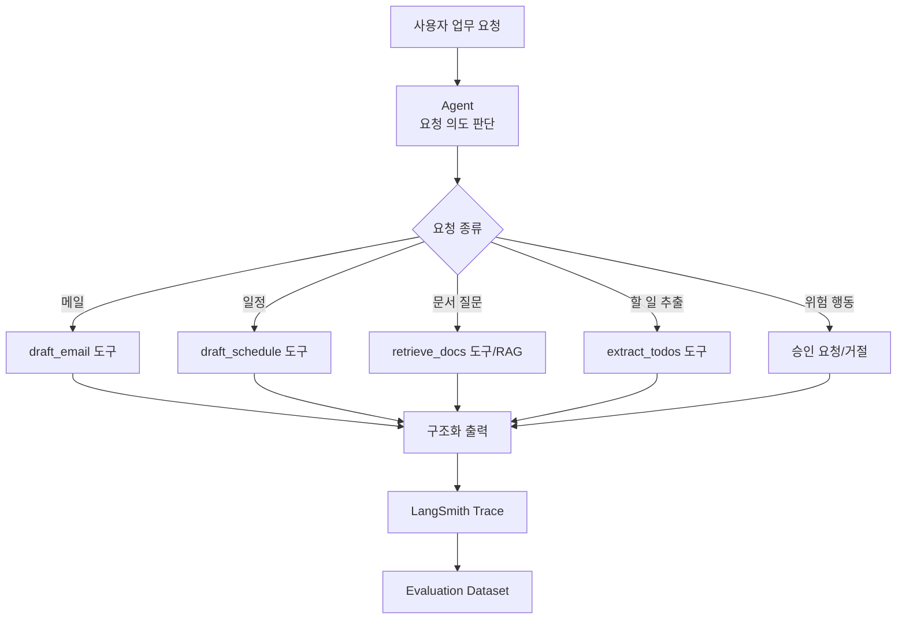

# 업무 자동화 에이전트: 배운 개념이 합쳐지는 모습

이제 앞의 개념들을 하나로 모아봅시다. 만들고 싶은 것은 문서, 메일, 업무 요청을 받아 적절한 도구를 선택하고 구조화된 결과를 반환하는 업무 자동화 에이전트입니다.



이 에이전트는 사용자의 요청 의도를 먼저 봅니다. 메일 초안이 필요한지, 문서 검색이 필요한지, 할 일 추출이 필요한지 판단합니다. 필요한 도구를 호출합니다. 위험한 행동은 바로 실행하지 않고 승인 요청으로 돌립니다. 결과는 사람이 읽기 좋은 문장뿐 아니라 앱이 읽을 수 있는 구조로 반환합니다. 그리고 LangSmith에서 trace를 보며 문제가 생긴 단계를 찾고, dataset으로 다시 평가합니다.

여기서 중요한 것은 "AI가 알아서 다 한다"가 아닙니다. 오히려 반대입니다. 좋은 LLM 앱은 모델이 할 일, 도구가 할 일, 사람이 승인해야 할 일을 분리합니다.

예시 출력은 이런 모양이 될 수 있습니다.

```json
{
  "request_type": "email_draft",
  "answer": "메일 초안 내용",
  "tools_used": ["draft_email"],
  "sources": [],
  "requires_approval": true,
  "warning": "실제 발송 전 사용자의 확인이 필요합니다."
}
```

| 기준 | 좋은 상태 | 위험한 상태 |
| --- | --- | --- |
| 의도 분류 | 요청 목적을 정확히 구분 | 메일 초안을 문서 질문으로 오해 |
| 도구 선택 | 필요한 도구만 사용 | 필요 없는 검색/도구 남발 |
| 안전성 | 실제 발송/삭제/결제는 승인 요구 | 위험 행동을 바로 실행 |
| 근거 사용 | 문서 질문은 출처를 함께 제공 | 근거 없이 그럴듯하게 답변 |
| 출력 구조 | 정해진 JSON/스키마 유지 | 자연어만 반환하거나 필드 누락 |
| 관찰 가능성 | LangSmith trace에서 단계 확인 가능 | 어디서 틀렸는지 추적 불가 |

> #### 이게 뭔데? 승인 대기
> AI가 초안을 만들 수는 있지만, 실제 발송이나 삭제처럼 되돌리기 어려운 행동은 사람이 확인해야 합니다. 승인 대기는 모델이 만든 결과를 바로 실행하지 않고 사람의 판단을 기다리는 상태입니다.

> #### 이게 뭔데? 출처
> RAG로 문서를 근거로 답했다면 어떤 문서에서 가져온 내용인지 표시하는 것이 좋습니다. 출처가 있어야 사용자가 답을 검증할 수 있고, 틀렸을 때 어떤 검색 결과가 문제였는지도 찾기 쉽습니다.

업무 자동화 에이전트는 LangChain의 여러 기능을 한 번에 다 쓰는 예시입니다. 메시지로 요청을 정리하고, agent가 도구 사용 여부를 판단하고, RAG가 문서를 찾아주고, memory가 대화를 이어주고, structured output이 결과를 정리하고, LangSmith가 과정을 관찰하고 평가합니다.

[이전 글](14_LangSmith_Evaluation.md) · [부록: 용어와 질문 모음](부록_A_용어와_질문_모음.md)
