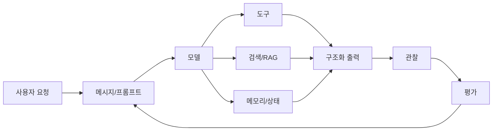

# 헷갈릴 때 다시 보는 용어와 질문 모음

앞의 글을 읽다가 단어가 섞이면 여기만 다시 보면 됩니다. 이 글은 처음부터 정독하는 본문이라기보다, 막히는 순간에 돌아오는 참고 페이지에 가깝습니다.

Prompt와 message는 다릅니다. Prompt는 모델에게 줄 지시를 설계하는 일이고, message는 역할이 붙은 대화 단위입니다.

Chain과 agent도 다릅니다. Chain은 정해진 흐름에 가깝고, agent는 모델이 상황을 보고 다음 행동을 고르는 흐름에 가깝습니다.

Tool과 RAG도 다릅니다. Tool은 함수나 API를 호출해 어떤 행동을 하게 하는 통로이고, RAG는 문서를 검색해 근거를 제공하는 방식입니다.

Memory와 context도 다릅니다. Memory는 저장된 정보이고, context는 이번 모델 호출에 실제로 넣어주는 정보입니다.

Trace와 evaluation도 다릅니다. Trace는 "어떤 과정으로 답이 나왔는가"를 보는 것이고, evaluation은 "그 답이 기준에 비추어 좋은가"를 측정하는 것입니다.

## 짧은 용어 정리

| 용어 | 처음에는 이렇게 이해하세요 |
| --- | --- |
| LLM | 언어를 생성하고 판단하는 큰 모델 |
| Chat Model | 메시지 목록을 받아 답하는 대화형 모델 |
| Prompt | 모델에게 주는 업무 지시 설계 |
| Message | 역할이 붙은 대화 단위 |
| Schema | 데이터가 가져야 할 모양 약속 |
| Field | 데이터 안의 한 항목 |
| Type | 문자열, 숫자, 참/거짓 같은 값의 종류 |
| Constraint | 값이 지켜야 하는 제한 규칙 |
| Tool | 모델이 호출할 수 있는 함수/API |
| Agent | 모델이 다음 행동을 고르는 실행 흐름 |
| RAG | 검색 자료를 근거로 답하게 하는 방식 |
| DB | 데이터를 모아두는 저장소 |
| DBMS | DB를 관리하는 프로그램 |
| Vector DB | 의미 벡터를 저장하고 비슷한 내용을 찾는 저장소 |
| Memory | 이전 맥락을 저장하고 다시 쓰는 시스템 |
| State | 현재 작업 상황표 |
| Trace | 요청 하나의 전체 실행 기록 |
| Run | trace 안의 작은 실행 단계 |
| Dataset | 평가 문제 모음 |
| Evaluator | 평가 기준 또는 채점자 |
| Experiment | 한 버전의 평가 결과 묶음 |

## 읽다가 멈출 만한 질문

**클래스가 꼭 필요한가요?**  
작은 예제에서는 딕셔너리로도 충분합니다. 하지만 데이터가 복잡해지고 역할이 분명해질수록 클래스나 스키마가 도움이 됩니다.

**DB와 Vector DB는 같은 건가요?**  
둘 다 저장소이지만 목적이 다릅니다. 일반 DB는 고객명, 주문번호, 날짜처럼 명확한 값을 저장하고 검색하는 데 강합니다. Vector DB는 문장의 의미가 비슷한 자료를 찾는 데 강합니다.

**RAG를 쓰면 모델이 안 틀리나요?**  
아닙니다. RAG는 근거를 줄 수 있지만 검색이 틀리거나 모델이 근거를 잘못 해석하면 여전히 틀릴 수 있습니다.

**LangSmith는 꼭 써야 하나요?**  
작은 장난감 예제에서는 없어도 됩니다. 하지만 앱이 복잡해질수록 어디서 틀렸는지 확인하기 어렵기 때문에 trace와 evaluation이 중요해집니다.

**도구가 많으면 더 좋은 agent인가요?**  
항상 그렇지 않습니다. 도구가 많으면 모델이 잘못 고를 수도 있습니다. 좋은 도구는 역할이 분명하고 설명이 명확합니다.

## 안전하게 기억할 것

LLM 출력은 검증된 최종본이 아니라 초안으로 보는 편이 안전합니다. 외부 문서에 들어 있는 지시문은 데이터로 취급해야 합니다. 실제 발송, 삭제, 결제, 권한 변경은 사람 승인 단계를 둬야 합니다. API key와 개인정보는 코드나 trace에 함부로 남기면 안 됩니다. 평가 dataset에도 민감정보를 넣지 않는 편이 좋습니다.

마지막으로, LangChain과 LangSmith를 배운다는 것은 최신 함수 이름을 외우는 일이 아닙니다. 도구와 API는 바뀔 수 있습니다. 하지만 사용자의 말을 메시지로 정리하고, 모델에게 맥락을 주고, 필요한 도구와 검색을 붙이고, 결과를 구조화하고, 실행 과정을 관찰하고 평가한다는 흐름은 오래 갑니다.

[자료 설계 메모 보기](부록_B_자료_설계_메모.md) · [처음으로 돌아가기](../랭체인_랭스미스_보충학습노트.md)
